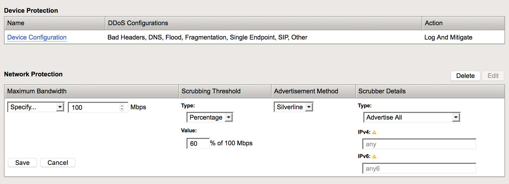
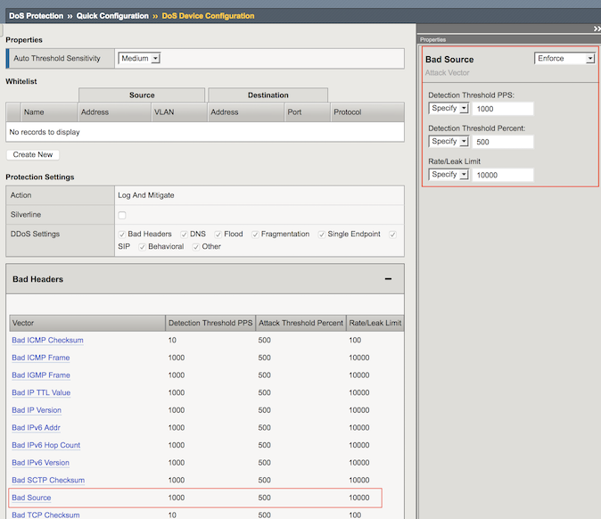
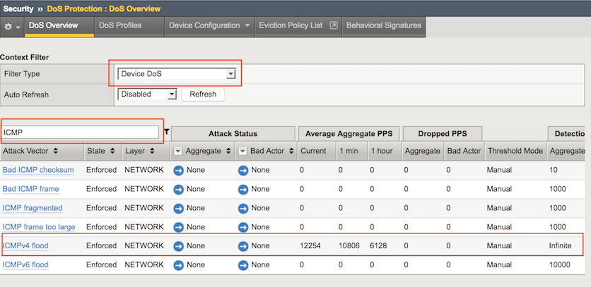
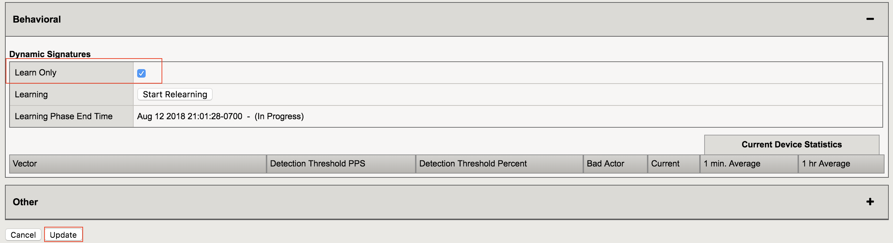

Lab – Launching Network-Level Flood Attacks
---------------------------------------------

    The idea in this lab is to observe how poorly the application performs when the network is under attack.

Configure DHD Device Bandwidth Thresholds
~~~~~~~~~~~~~~~~~~~~~~~~~~~~~~~~~~~~~~~~~~

    #. In the **Configuration Utility**, open the **Protected Objects** page.
    #. In the **Network Protection** section click **Create**.
    #. Configure as follows then click **Save**.

        ==========================   ==============
        Maximum Bandwidth: Specify   100           
        Scrubbing Threshold: Type    Percentage    
        Scrubbing Threshold: Value   60            
        Advertisement Method         Silveline       
        Scrubber Details: Type       Advertise All  
        ==========================   ==============

        |image15|

Turning Device-Level Protection off
~~~~~~~~~~~~~~~~~~~~~~~~~~~~~~~~~~~~
    
    #. In the **Configuration Utility**, in the **Device Protection** section click **Device Configuration**.  

        |image16|

    #. In the **Bad Headers** row click the **+** icon, and then click **Bad Source**.  

    #. On the right-side of the page configure using the following information.

        ============================   ==============
        Detection Threshold PPS        Infinite             
        Detection Threshold Percent    Infinite               
        Rate/Leak Limit                Infinite                   
        ============================   ==============

        |image17|

    #. Now In the **Flood** row, click the **+** icon, and then click **ICMPv4 flood**. 

    #. On the right-side of the page configure using the following information.

        ============================   ==============
        Detection Threshold PPS        Infinite             
        Detection Threshold Percent    Infinite               
        Rate/Leak Limit                Infinite                   
        ============================   ==============

        |image18|

    #. Apply the settings above for TCP SYN flood and UDP Flood. 

    #. In the **Behavioral** row click on **Learn Only**, then click **Update**.  

        |image23|

    #. On the **goodclient**, start the network baselining (Let it running for the entire lab) 

        ``sudo ~/tools_agility_183/baseline_l4.sh``  

        .. IMPORTANT::
            In order to assure best performance and good lab results, always use the management network ip addresses/hostnames for remote access  (goodclient-mgmt, attacker-mgmt and lamp-mgmt)

        .. code::

            f5student@goodclient:~$ cd ~/tools_agility_183/
            f5student@goodclient:~/tools_agility_183$ ./baseline_l4.sh
            /	status: 200	bytes: 3952	time: 0.016
            /	status: 200	bytes: 3952	time: 0.019
            /	status: 200	bytes: 3952	time: 0.014
            /	status: 200	bytes: 3952	time: 0.014
            /	status: 200	bytes: 3952	time: 0.018
            /	status: 200	bytes: 3952	time: 0.221
            /httprequest.php	status: 200	bytes: 699	time: 0.014
            /httprequest.php	status: 200	bytes: 699	time: 0.014

Launch an ICMP flood Attack on the LAMP Server
~~~~~~~~~~~~~~~~~~~~~~~~~~~~~~~~~~~~~~~~~~~~~~

        .. Hint::
            The pentest tool can be used to send several types of DoS Attacks for the most part of the lab, few free to try it out. For some specific exercises there will be custom shell scrtips though.  

            ``sudo ~/tools_agility_183/pentest``  

        .. code::

            ________ _______  _       _________ _______  ________  _
            |  ____  ||  ____ \| \    /|\__   __/|       ||  ____ \| \    /||\     /|
            | |    | || |    \/|  \  | |   | |   | || || || |    \/|  \  | || |   | |
            | |____| || |__    |   \ | |   | |   | || || || |__    |   \ | || |   | |
            |  ______||  __)   | |\ \| |   | |   | ||_|| ||  __)   | |\ \| || |   | |
            | |       | |      | | \   |   | |   | |   | || |      | | \   || |   | |
            | |       | |____/\| |  \  |   | |   | |   | || |____/\| |  \  || |___| |
            |/        (_______/|/    \_|   |_|   |/     \||_______/|/    \_||_______|

            Welcome to pentmenu!
            Please report all bugs, improvements and suggestions to https://github.com/GinjaChris/pentmenu/issues
            This software is only for responsible, authorised use.
            YOU are responsible for your own actions!
            Please review the readme at https://raw.githubusercontent.com/GinjaChris/pentmenu/master/README.md before proceeding

            1) Recon
            2) DOS
            3) Extraction
            4) View Readme
            5) Quit
            Pentmenu>

    #. Hit option **2** (DOS), then **1** (ICMP Echo Flood)  

    #. Use Attack options as follows:  

        ============================   ==============
        Enter target IP/hostname:       server1             
        Enter Source IP:                r (random)                                
        ============================   ==============

    #. Now open two more terminal sessions with **attacker** and **lamp** servers respectively. On each screen open the **bmon** util for instant traffic stats.  

        .. code::

            eth1                                                                         
            Interfaces                   │ RX bps       pps     %│ TX bps       pps     %
            lo                           │      0         0      │      0         0
            eth0                         │     66B        1      │    545B        1
                qdisc none (pfifo_fast)  │      0         0      │    525B        1
            ->eth1                       │     77B        1      │   1.59MiB  39.63K
                qdisc none (pfifo_fast)  │      0         0      │   1.59MiB  39.63K
            ───────────────────────────────┴───────────────────────┴────────────────────────────────────────────────────────────
                                        (RX Packtes/second)
                5.00 ....|..|.........|......|........................|..........
                4.17 ...|||||||...|...|.||.|||...........|||.......|..||.|.|...||
                3.33 ...||||||||..|..||||||||||..||.....|||||.....|||||||||||.|||
                2.50 ...||||||||..|..||||||||||..||.....|||||.....|||||||||||.|||
                1.67 .|||||||||||||.|||||||||||||||....|||||||...||||||||||||||||
                0.83 ||||||||||||||||||||||||||||||||.|||||||||..||||||||||||||||
                    1   5   10   15   20   25   30   35   40   45   50   55   60
                K                     (TX Packtes/second)
                52.32 ..............||||....|.||..................................
                43.60 ||.|||||||||||||||||||||||||||||||||..||||||||.|||||||||||||
                34.88 ||||||||||||||||||||||||||||||||||||||||||||||||||||||||||||
                26.16 ||||||||||||||||||||||||||||||||||||||||||||||||||||||||||||
                17.44 ||||||||||||||||||||||||||||||||||||||||||||||||||||||||||||
                    8.72 ||||||||||||||||||||||||||||||||||||||||||||||||||||||||||||
                        1   5   10   15   20   25   30   35   40   45   50   55   60

        .. Hint::
            Use either the RIGHT and LEFT arrow keys to move between Bps and pps metrics. Don't forget selecting the right inteface using the UP/DOWN arrow keys. **Attacker** uses eth1 and **Lamp** uses eth4 for data traffic.  

    #. Open a terminal session with the **DHD** and use the tcpdump util to verify that ICMP attack traffic is passing through the device.
    
        ``[root@dhd:Active:Standalone] config # tcpdump -i defaultVLAN`` 

    #. Observe the baseline running on goodclient. Since the flood attack is hitting the server hard, the legitimate client sessions are being degraded. Look at the statude code **000** for most requests.

    #. In the **Configuration Utility**, open the Statistics-> Performance-> Performance page. As you can see, there is a drastic spike in the traffic.

            |image19|

    #. Open the Security-> DoS Protection-> DoS Overview page.

    #. In the Filter Type field select **Device DoS**. Then on the left corner search for ICMP.

        |image20|

    #. Review the statistics for Current, 1 min. Average, and 1 hr Average.

    #. Open the Security-> Event Logs-> DoS-> Network-> Events page.
        The log file is empty as we disabled device-level flood protection on **BIG-IP DHD**.

    #. From the attacker terminal session type **Ctrl + C** to stop the ICMP flood.

.. |image16| image:: ../media/image016.png

.. |image18| image:: ../media/image018.png
.. |image19| image:: ../media/image019.png

