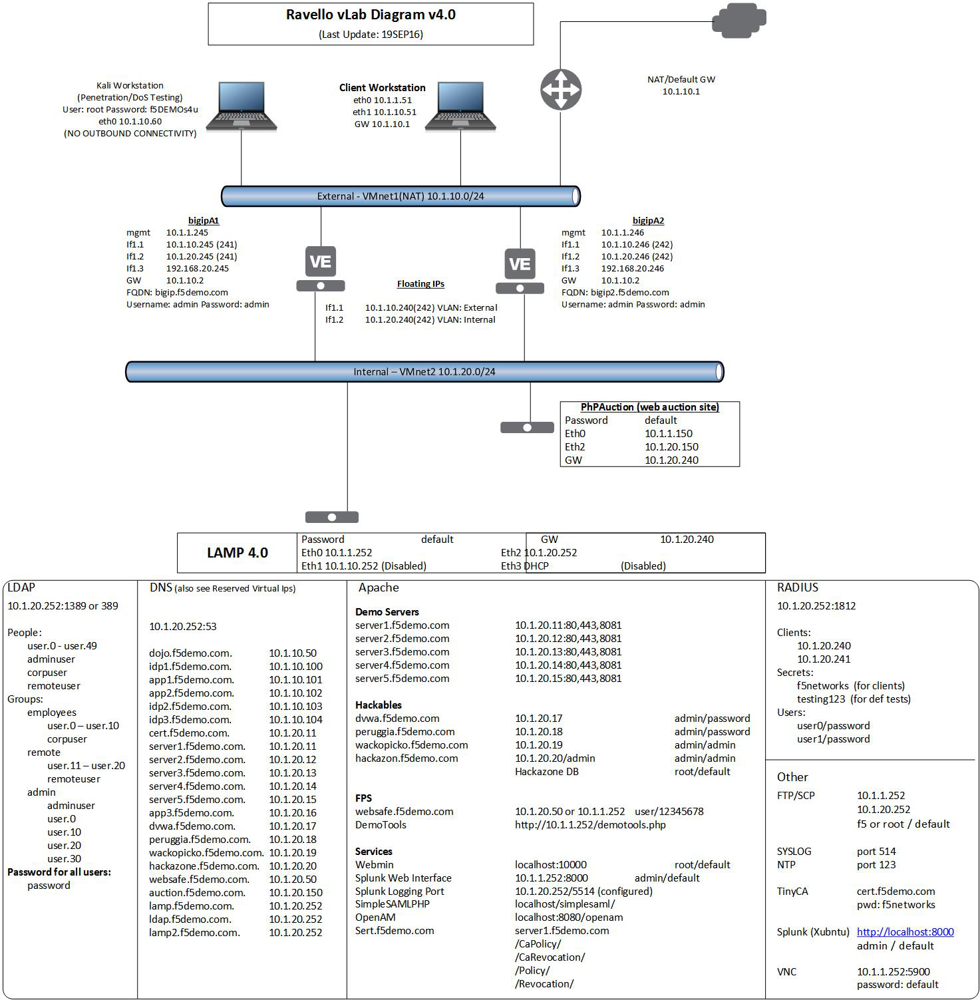
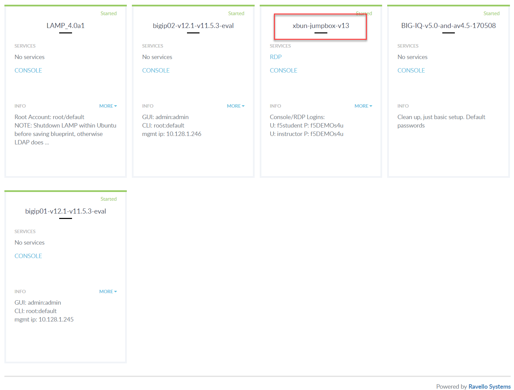
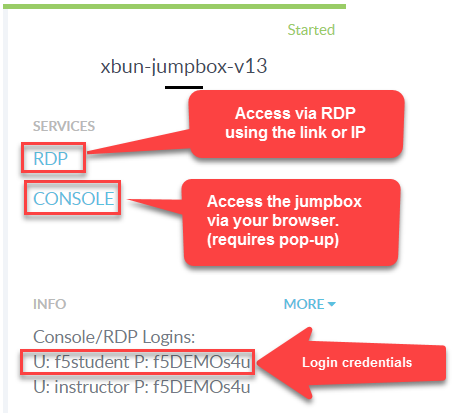

.. _getting-started:

Getting Started
===============

Please follow the instructions provided by the instructor to start your
lab and access your jump host.

.. NOTE::
	 All work for this lab will be performed exclusively from the Linux Workstation
	 jumphost. No installation or interaction with your local system is
	 required.

Lab Topology
^^^^^^^^^^^^^
|image2|

Lab Components
^^^^^^^^^^^^^^^

The following table lists VLANS, IP Addresses and Credentials for all
components:

.. list-table::
    :widths: 20 40 40
    :header-rows: 1
    :stub-columns: 1

    * - **Component**
      - **VLAN/IP Address(es)**
      - **Credentials**
    * - bigip01 
      - - **Management:** 10.1.1.245
        - **Internal:** 10.1.20.245
        - **External:** 10.1.10.245
      - ``admin``/``admin``
    * - bigip02 
      - - **Management:** 10.1.1.246
        - **Internal:** 10.1.20.246
        - **External:** 10.1.10.246
      - ``admin``/``admin`` 
    * - Ubuntu Linux Workstation
      - - **eth0:** 10.1.1.51
        - **eth1:** 10.1.10.51
      - ``f5student``/``f5DEMOs4u``
    * - Kali Linux Workstation
      - - **eth0:** 10.1.10.60
      - ``root``/``f5DEMOs4u``

Accessing Lab Environment
^^^^^^^^^^^^^^^^^^^^^^^^^^^
Please follow the instructions below to access the lab environment.

1. Open a browser and go to http://training.f5agililty.com/

|training_portal|

2. Use the class number and student number included on the class survey to login to the training portal.  Once logged in:

    a. Look for the **xubuntu-jumpbox-vxx**. You will use the |xj| for all the labs. (see below)

        |image3|

    b. You can click on **RDP** to RDP to the |xj|, or you can select the **CONSOLE** link and access the jumpbox via your browser.  **The CONSOLE link requires you turn off pop-up blockers.**

        |image4|

.. |training_portal| image:: _images/training_portal.png
    :width: 6.59740in
    :height: 5.73203in

