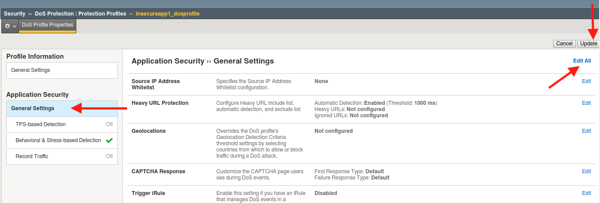
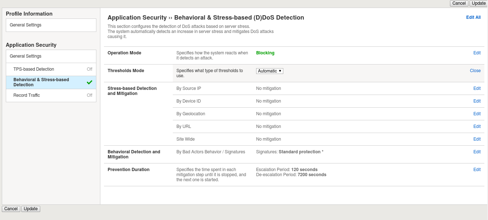
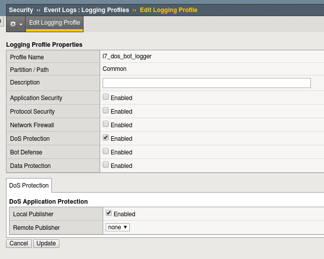
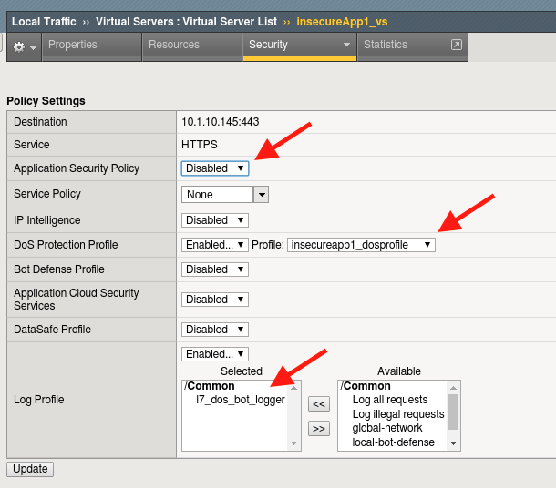
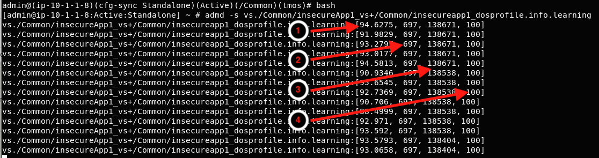

.. _module1:

Base Configuration and Traffic Baseline 
============================================================
In this module, we will configure the base DoS profile and |ltm| objects used in the remaining modules.  Additionally, you will generate traffic needed for |awaf| Behavioral DoS engine to build a learning baseline.

   **Objectives**:
      * Create DoS Profile
      * Create Logging Profile and attach to virtual server
      * Create iRule for inserting X-Forwarded-For headers and attach to virtual server
      * Generate good traffic to establish BaDOS baseline 
      * Verify BaDOS learning status

.. Attention:: In this lab, you will configure a number of options to get the lab started.  In modules 3 and 4 we will spend time examining the configuration options in more detail.  For now, just configure the options as outlined, and we will examine further in later modules.

Set up the DoS profile
^^^^^^^^^^^^^^^^^^^^^^
In the section you will create a DoS profile with **Behavioral Detection and Analysis** enabled and attach the DoS profile to the virtual server. 

1. Using Chromium Browser on the |xj|, open a tab to the GUI on bigip01 (https://10.1.10.245).  
   
   .. TIP:: If prompted for default keyring password from client workstation use the password associated with the f5student account

2. Navigate to **Security ›› DoS Protection : Protection Profiles**
3. Select **Create**. Name your profile **insecureapp1\_dosprofile** and select **Finished**. Open your **insecureapp1\_dosprofile** DoS profile.
4. Click **General Settings** under the Application Security heading, then click **Edit All** on the rightside of the panel.  This will activate the other sections of the DoS profile.

   |dos-prof-gen-settings-marked|

5. Select **Behavioral & Stress-based Detection** and change **Operation Mode** to **Blocking**.

   a. Set the **Thresholds Mode** to **Automatic**.

   b. Click **Edit** on the rightside of the row labelled **Behavioral Detection and Mitigation**
   
   c. Under **Behavioral Detection and Mitigation** check the **Request signatures detection** and set the **Mitigation** to **Standard**.  For now, please leave Bad Actors Detection, Accelerated HTTP Signatures, and TLS fingerprinting signatures unchecked.

   d. Click **Update** in the lower left-hand corner. collapse all the sections, and **Behavioral & Stress-based Detection** should match the figure below.

   |dos-prof-stress-review|

Create a DoS Logging Profile
^^^^^^^^^^^^^^^^^^^^^^^^^^^^^
Logging profiles are required to enable local and remote logging for Application DoS and bot events.  In this lab, we will use local logging to review events.  Below are the steps to configure the logging profile and attach to your test virtual server.

1. Go to **Security ›› Event Logs : Logging Profiles** and click **Create** on right-hand side of the configuration screen. Name your profile **l7\_dos\_bot\_logger** then check the **DoS Protection** **Enabled** boxes.

2. From the **DoS Protection** tab enable the **Local Publisher**.

3. Click **Update**.

   |log-prof-bot-options|

Add the DoS profile to a virtual server
^^^^^^^^^^^^^^^^^^^^^^^^^^^^^^^^^^^^^^^^

Below are the steps to associate this profile with the |ltm| virtual server processing the application traffic in this lab.

1. Navigate to **Local Traffic > Virtual Servers > Virtual Server List** and select **insecureApp1_http_vs**. Under the **Security** tab on the top bar select **Policies**.

2. Enable the **DoS Protection Profile** and select the **insecureapp1_dosprofile** profile.

3. In the **Log Profile** section of the configuration move the **local-dos** log profile from **Selected** to **Available** and move the **l7\_dos\_bot\_logger** from **Available** to **Selected**. Then click **Update**.

   |vs-appsec-policy-settings|

.. _XFF_iRule:

Create XFF-Mixed_Attacker iRule
^^^^^^^^^^^^^^^^^^^^^^^^^^^^^^^^
Because we do not have dozens of good and bad source IPs available for clients and attackers in this environment, we simulate them by adding an iRule to the virtual server.  The iRule adds a randomized X-Forwarded-For (XFF) header to each request.  

1. Navigate to **Local Traffic ›› iRules : iRule List** and select **Create.** Name a new iRule named **XFF\_mixed\_Attacker\_Good\_iRule.** Copy and paste the iRule below.

   .. code-block:: tcl
      :linenos:

       when HTTP_REQUEST {
         # Good traffic
          if { [[IP::client_addr] equals 10.1.10.100] } {
            set xff 153.172.223.[expr int(rand()*100)]
            HTTP::header insert X-Forwarded-For $xff
         }

         # Attack traffic
          if { [class match [IP::client_addr] equals "attacking_src_ips"] } {
            set xff 132.173.99.[expr int(rand()*25)]
            HTTP::header insert X-Forwarded-For $xff
         }
       }

   |awaf|/|asm| will honor the X-Forwarded-For header by enabling this in the http profile.

.. NOTE:: The iRule references a datagroup (attacking_src_ips) which has been created in advance.

Create HTTP Profile to Accept X-Forwarded-For HTTP Header
^^^^^^^^^^^^^^^^^^^^^^^^^^^^^^^^^^^^^^^^^^^^^^^^^^^^^^^^^^^

1. Navigate to **Local Traffic ›› Profiles : Services : HTTP** and click **Create**. Name the new http profile **xff\_http**, and click the rightmost checkbox in the row **Accept XFF** to enable a custom setting, then click the checkbox to the immediate right of **Accept XFF** to enable processing of an inbound X-Forwarded-For header.

2. Click **Update** button at bottom of configuration page.

.. TIP:: Due to a large number of service profiles, occasionally part of the Services menu will get stuck under the browser menu.  If that happens, click on **Profiles** on the side-bar, then click **Services** in the top navigation bar to get to the HTTP profile.

Attach iRule and HTTP Profile to |ltm| Virtual Server
^^^^^^^^^^^^^^^^^^^^^^^^^^^^^^^^^^^^^^^^^^^^^^^^^^^^^^
1. Navigate to the **insecureApp1_http_vs** virtual server. In the **Properties** tab, under **Configuration** section, select **xff\_http** for the **HTTP Profile**. 
2. Click the **Resources** tab in the virtual server navigation bar, in the **iRules** section select the **Manage** button, and move the **XFF\_mixed\_Attacker\_Good\_iRule** from the **Available** to the **Enabled** box. 
3. Click **Finished** button at bottom of the Resource Management page.

Generate Traffic to Establish Baseline
^^^^^^^^^^^^^^^^^^^^^^^^^^^^^^^^^^^^^^^
|awaf|'s Behavioral DoS feature is based on learning and analyzing all traffic to the web application, building baselines, and then idenitifying anamolies when server stress is detected.  As a result, in this lab, we need to generate normal traffic allowing |awaf| to build a baseline.

You will use the  |xj| to generate legitimate traffic and bad traffic, interface ens4 has [10.1.10.51-54, 10.1.10.100/24] configured.  The address 10.1.10.100 is used to source our "good" traffic and the 10.1.51-54 addresses are the source addresses used by our attack scripts of "bad" traffic. 

In the home directory (/home/f5student/agility2020wafTools) on the |xj|, you will find the two scripts used for this lab:

   * **baseline\_menu_http.sh** - is used to create baseline traffic
   * **AB\_DOS.sh** - is used to launch L7 DOS attacks

1. Start baseline traffic, using |xj| Terminal application, navigate to the home directory, then type:

   .. code-block:: console

      f5student@client01:~/agility2020wafTools$ ./baseline_menu_http.sh

      - Select option 2 **alternate** and keep it running in the window

   .. TIP:: This is your valid traffic and the number of requests will change over time. The requests also change as the script continuously alters the User-Agent header and the requested URI. Both values are randomly taken from files in the “source” directory in the home directory.

2.  Next, validate you are seeing the traffic, and |awaf| is actively building learning baselines. From a separate Terminal window or tab:

   .. code-block:: console
    
      f5student@client01:~/agility2020wafTools$ ssh admin@10.1.10.245

   Then, run the following commands:

   .. code-block:: console

      admin@(ip-10-1-1-8)(cfg-sync Standalone)(Active)(/Common)(tmos)# bash
      [admin@ip-10-1-1-8:Active:Standalone] config # admd -s vs./Common/insecureApp1_http_vs+/Common/insecureapp1_dosprofile.info.learning

      - /Common/insecureApp1_http_vs  – is the name of the virtual server
      - /Common/insecureapp1_dosprofile    – is the name of the DoS profile.
      **It may take several minutes for baseline numbers to be generated**

   Screenshot of sample output below:

   |shell-admd-output|

   .. TIP:: If your aren't getting any output, or seeing no signs of accumulated signals, verify the name of the virtual server and profile in the admd command are accurate.

   1. **baseline\_learning\_confidence**: 
      
      - **Description**: in % how confident the system is in the baseline learning.
      - **Desired Value**: > 90%
   
   2. **learned\_bins\_count**:
      
      - **Description**: number of learned bins
      - **Desired Value**: > 0
   
   3. **good\_table\_size**:
      
      - **Description**: number of learned requests
      - **Desired Value**: > 2000
   
   4. **good\_table\_confidence**:
    
      - **Description**: how confident, as %, the system is in the good table
      - **Desired Value**: Must be 100 for signatures

   .. NOTE:: It may take 5 or more minutes before you begin to get learned baseline numbers.  Also, the desired values are the minimum values we would like to see prior to triggering attacks as part of this lab exercise. You can, however, move onto module 3 and 4 in this lab while baselines are being established.  **Do not stop baseline traffic script**
        
    
   To see all of the values available and wide range of interesting statistics, enter the following command from |bip| console:

   .. code-block:: console

      [admin@ip-10-1-1-8:Active:Standalone] config #admd -s vs./Common/insecureApp1_vs

        
   To view |awaf| layer 7 DoS log, enter the following command from |bip| console:

   .. code-block:: console
    
      [admin@ip-10-1-1-8:Active:Standalone] config #tail -f /var/log/dosl7/dosl7d.log
    

