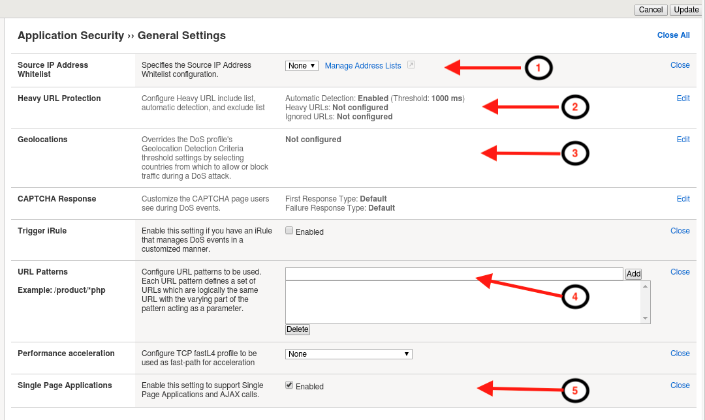
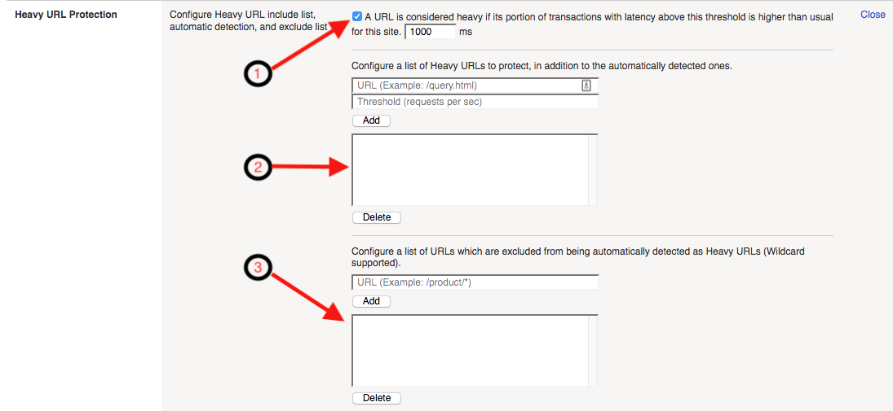
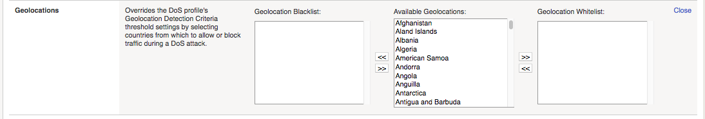

.. _module2:

.. NOTE:: The goal of this module is to explain DoS profile configuration options.  The module does not contain any exercises.  If you are already familar with a the settings in an Application Security DoS profile you can skip to module 4.

Application Security DoS Profiles
==================================================

In this module, we will review the various settings and options that make up a layer 7 DoS profile.  We will not review each and every setting, leaving that exercise up to the reader, but instead will focus on key settings which will most likely require attention during a production deployment.  More detail on each individual setting can be found by viewing the **Help** on left side of the |bip| Configuration Utility (GUI).

Review DoS Profile General Settings
^^^^^^^^^^^^^^^^^^^^^^^^^^^^^^^^^^^

Navigate to **Security ›› DoS Protection ›› DoS Profiles** and click the DoS profile **hackazon_bados** created earlier for this module.
 
Settings in this screen are profile wide, and can affect all aspects of the dos configuration.

|gen-settings|

1.  **Application Security** 
   This setting enables or disables the DoS profile.

2.  **Heavy URL Protection**
   Heavy URL's are application resources which may consume more backend resources with each client request.  Additionally, URLs which are not generally considered heavy may become heavy under significant load or attack.  As a result,  low rate requests targeting these URLs can cause significant DoS attacks, and be difficult to differentiate from legitimate requirements based on rate alone.  |awaf| automatically detects heavy URLs by measuring the latency tail ratio, which is the number of transactions whose latency is consistently greater than the latency threshold defined in this configuration option.  A URL is considered heavy if its latency is more than two times the site global average over a 24 hour (default) period.
        
   |heavy-url-det|
            

   1. Checkbox, enables or disables, automatic detection of the heavy URLs profile-wide.  The text box allows for configuration of the baseline threshold that URLs must exceed before being considered for heavy URL determination.  

   2. This section of the DoS Profile Heavy URL configuration allows an administrator to explictly configure a URL(s) as heavy, whether it is detected as heavy by |awaf| or not.  Use this section to define application resources which are known to be heavier in terms of resource consumption, or known to be less resilient to higher volumes of traffic than the rest of the application.

   3. This section of the Dos Profile Heavy URL configuration allows an administrator to explictly configure URL(s) and wildcard URL patterns to be excluded from automatic heavy URL detection.  Use this section, to identify URL's which you know may perform slower than average under normal conditions, or URLs you do not wish to have |awaf| offering heavy URL protection.

      .. NOTE:: To provide mitigation for heavy URLs, you must enable at least one of the URL-based prevention policy methods in the TPS or Stress-based Anomaly sections of the DoS profile.
        
3. **Geolocations**
   Geolocations provides options to override the dos profile geolocation detection criteria by explicity whitelisting or blacklisting specific geolocations.

   |geolocs| 

4. **Single Page Application**
   Single Page Applications (SPA) represent a change in application architecture that moves much of the content rendering and routing to client-side code.  Application requests which require server-side processing are sent as AJAX requests towards server, and the response is typically JSON/XML; this is different from traditional web applications that send HTTP requests, and generally levergage HTML as the predominant response content type. As a result, |awaf| needs to modify the way it challenges clients for features like Proactive Bot Defense and capturing Device ID in the TPS/Stress based anomaly detections.  Enabling this option modifies |awaf|'s challenge and challenge validation mechanisms.  When deploying L7 DoS protections it is important to understand the application architecture, and if protecting a SPA, enabling this option is critical for proper operation.  

