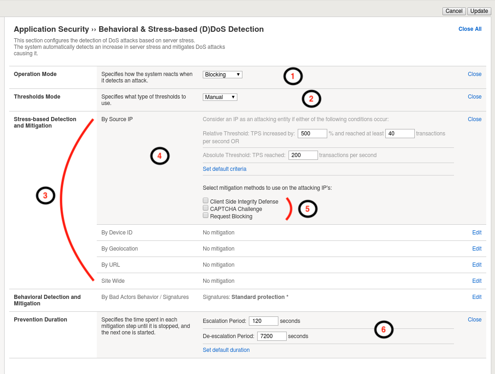
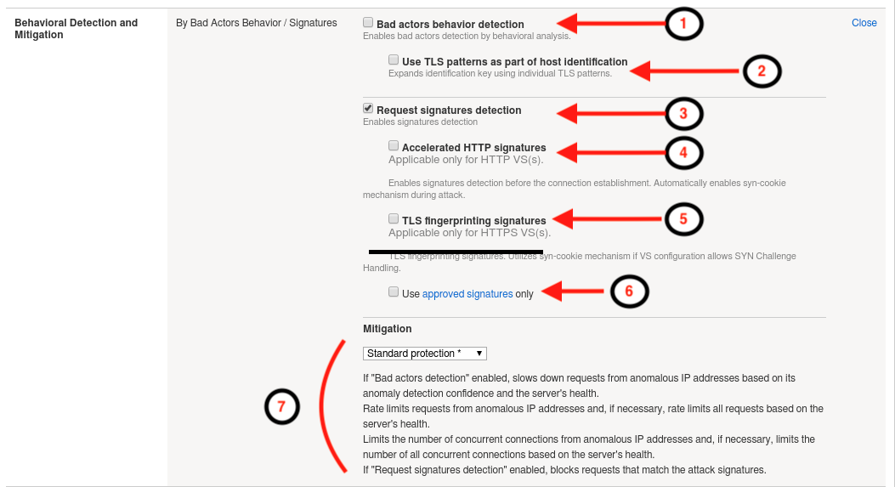

.. _module3:

.. NOTE:: The goal of this module is to explain the Stress-Based and Behavioral DoS configuration options.  The module does not contain any exercises.  If you are already familar with a the settings you can skip to module 5.

Stress-Based and Behavioral DoS Profile Settings
=================================================

In this module, we will review the various settings for configuring Stress-based and Behavioral DoS protections in more detail.  We will not review each and every setting, leaving that exercise up to the reader, but instead will focus on key settings which will most likely require attention during a production deployment.  More detail on each individual setting can be found by viewing the **Help** on left side of the |bip| Configuration Utility (GUI).

Review Stress-Based Dos Profile Settings
^^^^^^^^^^^^^^^^^^^^^^^^^^^^^^^^^^^^^^^^^
To appreciate the powerful nature of |awaf|'s Behavioral DoS feature, it first makes sense to analyze one of the other L7 DoS protection mechanisms.  For this exercise, we will examine the options and behaviors of the Stress-based DoS protections available in an Application Security DoS profile.

To review the settings below, navigate to **Security ›› DoS Protection ›› DoS Profiles**, click the DoS profile **hackazon_bados** created earlier for this module, then click **Behavioral & Stress-based Detection** in the **Application Security** navigation menu, and set the **Operation Mode** to **Transparent**.

|stressbased|

1. **Operation Mode**
   Defines the operational mode for the stress-based dos protection feature.  Available options include: Blocking, Transparent, Off.  Blocking means feature will detect, report, and mitigate.  Transparent means feature will detect, report, but will not mitigate.  Off means the feature is disabled.

2. **Threshold Mode**
   Defines how |awaf| derives thresholds to be used in detecting the TPS component of a stress-based attack.  Options include:
      * **Manual**: Administrator explicity configures TPS and percentage thresholds based on their knowledge of the environment or specific requirements.
      * **Automatic**: |awaf| monitors traffic rates automatically and calculates the thresholds based on normal traffic volume to the application.

3. **Stress-based Detection Options**
   |awaf| can trigger an attack if any/all of the following detection methods exceed the thresholds defined or calculated for the detection method:
      * **By Source IP**: A specific source IP has exceeded the thresholds defined in the detection thresholds.
      * **By Device ID**: A specific device has exceeded the thresholds defined in the detection thresholds.  Device ID is ASM calculating a fingerprint for a given device.  The feature requires Javascript injection for proper operation.  However, the feature offers the benefit of detecting a specific device, even if the attack varies its source IP address.
      * **By Geolocation**: A country/geolocation has exceeded the thresholds defined in the detection thresholds.
      * **By URL**: Request traffic to a specific (or set of URL's identified in URL patterns section of the DoS Profile General Properties) has exceeded the thresholds defined in the detection thresholds.
      * **Site Wide**: Request traffic to the entire web site has exceeded the thresholds defined in the detection thresholds, **and** an attack has not been detected using any of the other detection criteria.  Site-wide is considered last resort.

   .. NOTE::
      It is important to understand that while stress-based protections are monitoring server latency, and tracking application request volume in short and long term intervals, the detection methods listed above are the only ways to identify when an attack is on-going.  This, as you will see, is quite a bit different than they way |awaf| Behavioral DoS feature identifies attacks and attackers!

Review Behavioral DoS Settings
^^^^^^^^^^^^^^^^^^^^^^^^^^^^^^^^
Having reviewed the options for configuring Stress-based dos mitigation, now let's examine the options required for configuring |awaf|'s Behavioral DOS mitigations.

|bados|

1. **Bad Actors Behavior Detection**
   Determines whether Behavioral DoS engine tracks and attempts to identify the bad actors contributing to a given set of malicious traffic.  When Bad Actor Behavior Detection is enabled, once |awaf| detects server stress  and identifies a set of malicious traffic contributing to the server stress, the Behavioral DoS engine then attempts to identify what source IP addresses are generating the malicious traffic, and what percentage of malicious traffic a given bad actor is contributing.  Bad actors, are mitigated at transport layer via slowdown mitigation techniques, and the rate at which they are mitigated is directly related to their percentage of contribution to the malicious traffic set, and the migitation mode selected.

2. **Request Signature Detection**
   Determines whether Behavioral DoS engine will attempt to generate a traffic signature to block anamolous traffic.  |awaf| Behavioral DoS feature is in a permanent learning state, always tracking application requests, and the construction of these requests, and then comparing to an evolving baseline.  When Request Signatures Detection is enabled, once |awaf| detects server stress, it looks to identify traffic characteristics which have deviated from the baseline.  If there are deviating characteristics, the Behavioral DoS engine, then dynamically generates a signature based on these deviating characteristics to block anamolous traffic. 

      .. NOTE:: In addition to generating signatures the Behavioral DoS Engine also continually evaluates the signature for efficacy, minimizing the risk of signature becoming false positive and blocking known good traffic.

3. **Use Approved Signatures Only**
   By default, when Request Signatures Detection is enabled, |awaf| will generate and use dynamically generated attack signatures as defined by the mitigation mode selection.  By enabling this option, the administrator overrides this behavior, and forces a manual step to review and approve the signature prior to any mitigations taking effect.  Signatures can be reviewed from |awaf| GUI via **Security** -> **DoS Protection** -> **Signatures**.

      |sigs-approval|

    
      Once a signature has been approved, the Signature Approval State for the signature will change to "Manually-approved".  When approved signatures only is selected, only signatures which have been approved will be active.

4. **Mitigation**
   Defines the mitigation mode for |awaf| Behavioral DoS.  Options include:
      * **No Mitigation**: 
         * Monitors traffic, generates signatures, and identifies bad actors, but does not perform any mitigation.
      * **Conservative Protection**: 
         * **If** Bad Actors Behavior Detection is enabled, slows down bad identified bad actors.
         * **If** Request Signatures Detection is enabled, blocks requests that match attack signatures
      * **Standard Protection**:
         * **If** Bad Actors Behavior Detection is enabled, slows down bad identified bad actors.
         * **If** Request Signatures Detection is enabled, blocks requests that match attack signatures
         * Rate limits all requests based on server health
         * Limits the number of concurrent connections from bad actor IP addresses
         * If necessary, limits the number of all concurrent connections based on server health
      * **Aggressive Protection**:
         * **If** Bad Actors Behavior Detection is enabled, slows down bad identified bad actors.
         * **If** Request Signatures Detection is enabled, blocks requests that match attack signatures
         * Rate limits all requests based on server health
         * Limits the number of concurrent connections from bad actor IP addresses
         * If necessary, limits the number of all concurrent connections based on server health
         * **Proactively** performs all protection actions, even before attack detection, increasing impact of protection techniques.

   |awaf| mitigates DoS with the most effective and efficient method available, and as quickly as possible to restore server health.  Meaning, the mitigation method will often change over time as more data is learned and analyzed.  For example, at the onset of an attack, |awaf| may apply global rate limiting in an attempt to mitigate an onslaught of traffic.  Then, as the signature engine has observed enough traffic to identify malicious traffic and generate a signature, the Behavioral DoS engine will begin mitigating with request signatures and discontinue global rate limiting.  Finally, as bad actors are identified, traffic from those sources is mitigated using layer four slowdown mechanisms, and request signatures are only used for traffic matching the signature and not in the bad actor list.  This approach allows |awaf| to perform better under attack, and mimimizes the risk of blocking good traffic while mitigating DoS.

Summarizing Key Points
^^^^^^^^^^^^^^^^^^^^^^^^
After reviewing several options for both Stress-based and Behavioral DoS features, the goal of this section is to call out some key points which might be overlooked when reviewing configuration options:

   * All DoS features are complementary to |awaf| web application firewall (WAF) and bot protection features.  DoS features mitigate traffic that exceeds a certain rate or induces server-side stress.  This traffic is, many times, completely legitimate traffic which will not trigger a WAF block.

   * Heavy URL, TPS-based DoS, Stress-based DoS, and Behavioral DoS features can all be configured concurrently, complementing one another, or separate and independent of one another.  

   * Both Stress-based and Behavioral DoS protection features continually monitor application server performance for signs of server stress.  Both features will consider server stress as a key component in detecting an attack, and neither will trigger a mitigation if the server is perceived to be healthy.  

   * Stress-based and TPS based DoS features can detect DoS attacks across a pre-defined set of detection criteria (source IP, URL, device ID, geolocation, site).  Behavioral DoS is not constrained to a pre-defined set of detection criteria, but instead is a self adjusting dynamic DoS defense system which can detect DoS across hundreds of traffic predicates.  As a result, Behavioral DoS, is much more effective in mitigating multi-vector layer seven DoS attacks which mutate over time.  Conversely, TPS and/or Stress-based DoS features are much better at defining specific rate limits for traffic entering your application.

.. |sigs-approval| image:: _images/sigs-approval.png
   :width: 6.59740in
   :height: 2.33203in
