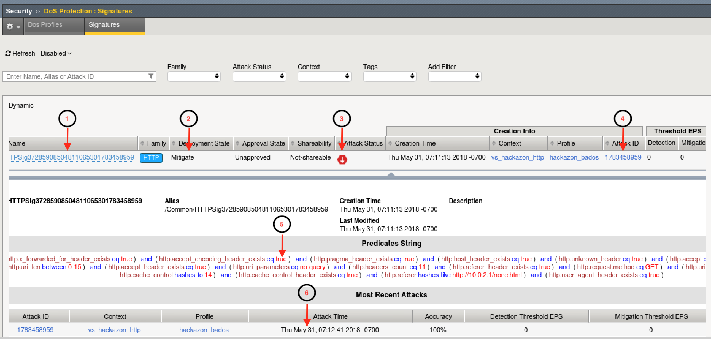

.. _module4:

Request Signatures
==============================================================
In this module you will be initiating a L7 DDoS attack on the hackazon virtual server, from eth1, using 10.1.10.53 as the source IP address. This source IP will match XFF\_mixed\_Attacker\_Good\_iRule, and an X-Forward-For header will be inserted in the HTTP request in the 132.173.99.0/24 IP address range.

Once the attack begins the BIG-IP WAF (ASM) will immediately switch into attack mode due to the server health deteriorating almost immediately. As the server gets totally overwhelmed, you may at first notice the good script dropping requests. *That’s why BaDoS first mitigates with a global rate limit just to protect the server*. In a short time, the good script will go back to all 200 OK responses. During this time Behavioral DoS identifies anamolous traffic and generates **Dynamic Signatures** matching only the malicious traffic. Once mitigation is in effect, the server health will rapidly improve and application performance will return to normal.

1.  Using Chromium Browser on the |xj|, open tab to the GUI on bigip01 (https://10.1.1.245)

2.  Navigate to **Security ›› DoS Protection:Signatures** and click on the **Dynamic** box, then set the **Refresh** value to **20 secs**. 

3.  Open another tab/window in Chromium Browser, and go to **Security ››Reporting : DoS : Dashboard**. The dashboard is NOT real time in may take up to 10 minutes for traffic to display.

4.  Revisit the Terminal window you opened earlier which is monitoring behavioral DoS learning signals.  Verify the first number (baseline\_learning\_confidence) is at or above 80%.  Normally, above 90% would be ideal, but for the purposes of this lab over 80% will suffice.

5.  Revisit the Terminal window you opened earlier which is still running the baseline traffic generation script.  Make note of the normal, pre-attack, response time for each request.

6. From |xj| open a NEW Terminal window. From your home directory
   enter:

   .. code-block:: console

      f5student@xjumpbox~$ ./AB_DOS.sh
        
      - Select **2** – Attack start - score

7.  Using Chromium Browser on the |xj|, open another tab to the GUI on bigip01, and navigate to **Security ›› Event Logs ››  DoS ›› Application Events**

8.  Almost immediately you should see an attack has started, and |awaf| has assigned an Attack ID to the event.  You will see something similar to the screenshot below:
   
   |event-log-bados-start|

9.  Review the **Dyanmic Signatures** UI page opened in step #2. It might take a few moments for a dynamic signature(s) to generate, but shortly after the attack has been detected a signature should be created.  Once a signature(s) is generated, if you click on the signature (NOT on the blue link, but somewhere on the signature bar), you will get the details about the signature in Wireshark format.  Also, you can examine the current status of the signature (mitigating or not), and statistics on recent attacks which used the signature.

   |dos-attack-sig-detail|

   - **Signature ID**: Signature ID generated for this signature.  You can use the signature ID in DoS Analysis/Dashboard views (explored in module 6) to get more details on actions taken by this signature.

   - **Deployment State**: current state of the signature.  Options include:
     
      * **Mitigate** - Collect stats, learn, alert, and mitigate.  All thresholds and threshold actions are applied, and rate limiting occurs if the device is under high stress.  
      * **Detect Only** - Collects stats, learn, and alert.  Develops dynamic signatures without enforcing any thresholds or limits.  
      * **Learn Only** - Collect stats and learn.  Develops dynamic signatures without enforcing any thresholds or limits
      * **Disabled** - No stat collection or mitigation, totally disables the signature.

   - **Attack Status** - the state of the signature with respect to ongoing attacks.  Specifically, defines whether this particular signature is being used to mitigate an on-going attack.

   - **Attack ID** - the attack ID for the attack that generated this signature.  Clicking the attack ID will take you to the DoS Analysis views filtered on this attack ID.

   - **Predicates List** - the conditions for the request to be associated with this signature.  Includes one or more match ,expresssions, joined by logical operators, which the system uses to match traffic causing a DoS attack.

   - **Attack History** - provides an account of all attacks in which this signature has been used to mitigate.  

   .. NOTE:: Dynamic Attack signatures generated will remain in the list up to the max number of signatures supported, and will be will re-used whenever an attack is detected, and traffic matches the conditions defined in the signature

10.  With the attack script still running, examine the output of the baseline script.  You should be getting HTTP 200 OK responses, and the response time should be inline with pre-attack response times.  Also, verify you can use browse to http://hackazon.f5demo.com without issue.

11.  In the window where you are running the attack script, enter **CTRL-C**, then type **4** to kill the attack script cleanly.  

12.  Using Chromium Browser, navigate to **Security ›› DoS Protection:Signatures** and click on the **Dynamic** box.  Then click the check box next to the Name column to select all signatures, and click delete to remove all attack signatures created during this module.

13.  Leave **baseline_menu.sh** script running.

.. |event-log-bados-start| image:: _images/event-log-bados-start.png
   :width: 6.59740in
   :height: 1.33203in

