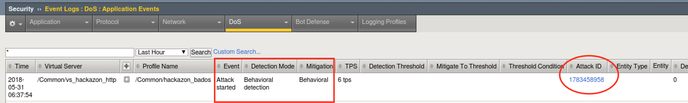
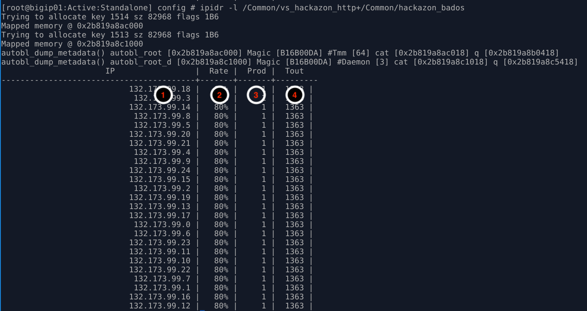

.. _module5:

Bad Actor Detection 
====================
In the last module, you used request signature detection to mitigate an application layer DoS attack.  You also saw the Behavioral DoS engine deploy global rate limiting to bring the servers back to health while signatures were being generated, then mitigate targeted attack traffic with the newly generated signature.  In this module, we will leverage Bad Actor Detection to throttle known bad actors.

1.  Navigate to **Security ›› DoS Protection : DoS Profiles** and click the hackazon_bados profile we created earlier.

2.  Click the **Application Security** tab, and then click **Behavioral & Stress-based Detection** button in the Application Security panel.

3.  Click the **Edit** link to the right of the **Behavioral Detection and Mitigation** section, then check the checkbox for **Bad actors behavior detection**, and uncheck the box next to **request signatures detection**

4.  Scroll down, and click the **Update** button.

5.  From the |xj| open another Terminal window.  Then:

   .. code-block:: console
    
      f5student@xjumpbox$~ ssh root@10.1.1.245

6.  From the SSH session, run the following command: 

   .. code-block:: console

      [root@bigipo01:Active:Standalone] config # watch ipidr -l /Common/vs_hackazon_http+/Common/hackazon_bados

   Initially, because no attack is active, the IP list will be empty.  Keep this command running in one of the Terminal windows.  Things are about to change!

7.  Using the Terminal window on the |xj| from the previous module, or a new one, re-run the attack script using the following command:

   .. code-block:: console

      f5student@xjumpbox~$ ./AB_DOS.sh
        
      - Select **2** – Attack start - score

8.  Using Chromium Browser on the |xj|, open another tab to the GUI on bigip01, and navigate to **Security ›› Event Logs ››  DoS ›› Application Events**

9.  Almost immediately you should see an attack has started, and |awaf| has assigned an Attack ID to the event.  You will see something similar to the screenshot below:
   
   |event-log-bados-start| 
    

10.  From the Terminal window started in step #6, monitor the output of the ipidr command, and the status of the IP greylist.  You should see something similar to the image below:

    |ipidr-output|

   1. **IP**: IP address that is member of the greylist
   2. **Rate**: Probability of drop for an ingress packet.  Higher number equals higher drop rate at the TCP layer.  As drop rate goes up, retransmit rates increase, and subsequently TCP window sizes adjust closer to zero.  Also, note this behavior will be different if the client IP is learned through a layer 7 header.  If so, the behavior will be an HTTP rate limit versus TCP based mitigations.
   3. **Prod**: Number of stat producers.  In this environment, this should always be 1.
   4. **Tout**: Time-out/TTL. Prior to releasing an IP address from the greylist, |awaf| will quarantine the IP address for a period of time.  During this time, TCP slowdown methods will discontinue, and HTTP rate limiting will take over.  If during the quarantine period, the IP address triggers more attack traffic, the IP will be removed from quarantine and placed back in greylist.  Quarantined IP addresses are visible in the DoS Dashboard/Analytics views in the Mitigation panel.

11. With the attack script still running, examine the output of the baseline script.  You should be getting HTTP 200 OK responses, and the response time should be inline with pre-attack response times.  Also, verify you can use browse to http://hackazon.f5demo.com without issue.

12. In the window where you are running the attack script, enter **CTRL-C**, then type **4** to kill the attack script cleanly.

13.  Leave baseline_menu.sh script running.

