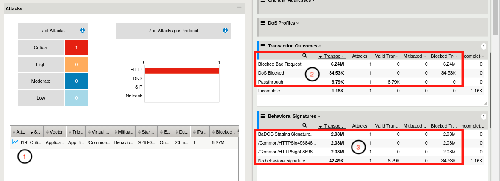
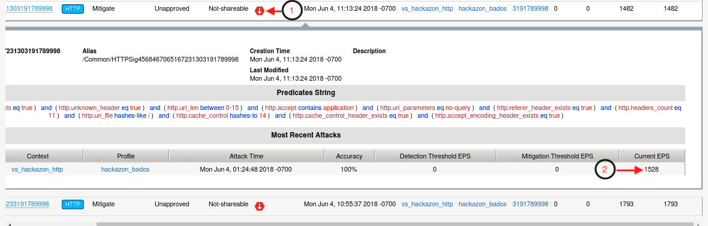
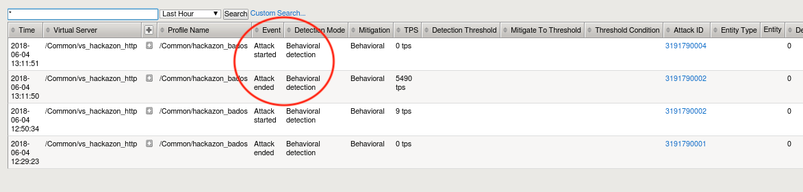
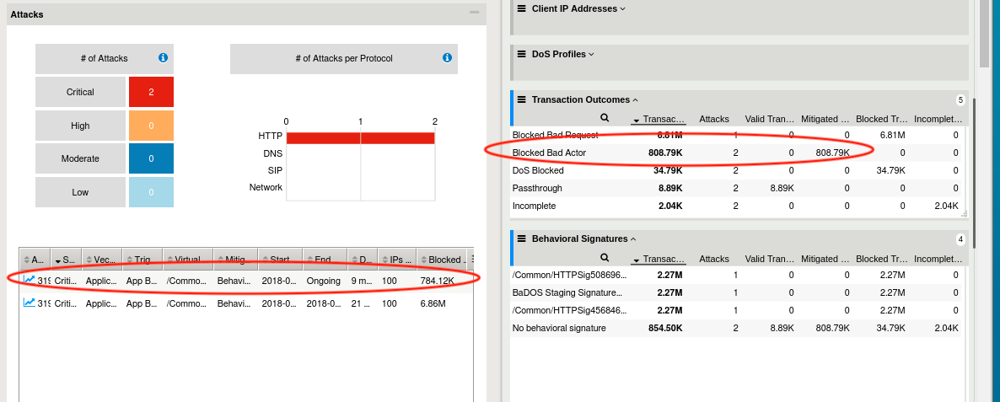

.. _module6:

Bad Actor Detection and Request Signatures
======================================================================================
In the previous modules, we examined both request signature detection and bad actor detection mitigations individually.  In this module, we will enable both mitigations together, and explore how they operate in tandem to mitigate a DoS attack.  Additionally, we will use |awaf|'s DoS Reporting tools to further inspect the details of each attack.

1.  Using Chromium Browser on the |xj|, open another tab to the GUI on bigip01

2.  Navigate to **Security ›› DoS Protection : DoS Profiles** and click the **hackazon_bados** profile we created earlier.

3.  Click the **Application Security** tab, and then click the **Behavioral & Stress-based Detection** button in the Application Security panel.

4.  Click the **Edit** link to the right of the **Behavioral Detection and Mitigation** section, then uncheck the checkbox next to **Bad actors behavior detection**, and check the box next to **Request signatures detection**

5.  Scroll down, and click **Update** button.

6.  Navigate to **Security ›› Reporting ›› DoS ›› Dashboard**

7.  From the **DoS Dashboard** select the refresh drop down and set value to 1 min, and grab the slider bar at the top and drag it as far right as possible.

8.  On the right side of the **DoS Dashboard**, grab the handle just to the right of the HTTP and Network filter labels, and pull left to the midway point of the screen.

9.  Using the inner-most vertical scroller on the right-hand side of the screen, scroll down until you see the **Transaction Outcomes** dynamic panel.  Click the panel to expand, then click the three vertical lines to the left of the Transaction Outcomes label.  Click on **Columns**,  and click the green icon to remove all row labels except the following:
   * Transactions
   * Attacks
   * Valid Transactions
   * Mitigated Transactions
   * Blocked Transactions
   * Imcomplete Transactions

10.  Repeat the same process to filter the **Behavioral Signatures** dynamic panel.

11.  With the baseline traffic still running, examine both the **Transaction Outcomes** and **Behavior Signatures** panels.  You should see all transactions have an outcome of **Passthrough**.  Also, the center column of the main dashboard view should show no current attacks in progress. Keep this window open.  

12.  From the |xj| open another Terminal window, or return to a previously opened window.  Then:

   .. code-block:: console
    
      f5student@xjumpbox$~ ssh root@10.1.1.245

13.  From the SSH session, run the following command: 

   .. code-block:: console

      [root@bigipo01:Active:Standalone] config # watch ipidr -l /Common/vs_hackazon_http+/Common/hackazon_bados

14.   From the |xj| open another Terminal window, or return to a previously opened window.  Then, re-run the attack script using the following command:

   .. code-block:: console

      f5student@xjumpbox~$ ./AB_DOS.sh
        
      - Select **2** – Attack start - score

15.  Open another tab to the GUI on bigip01, and navigate to **Security ›› Event Logs ››  DoS ›› Application Events**

16.  Almost immediately you should see an attack has started, and |awaf| has assigned an Attack ID to the event.  You will see something similar to the screenshot below:
   
   |event-log-bados-start| 

17.  Open another tab to the GUI on bigip01, and navigate to **Security ›› DoS Protection : Signatures**, and click on the **Dynamic** box, then set the **Refresh** value to **20 secs**.  In a few moments, you should see request signatures being generated.

18.  Return to the browser tab opened to the DoS Reporting Dashboard.  Monitor the **Transaction Outcomes** and **Behavioral Signatures** dynamic panels.  After a few minutes, you will begin to see signature based mitigations, and your dashboard should like similar to the image below:

   |dos-dash-reqsig|

   1.  DoS Dashboard view shows an attack has been triggered.  Select the attack, click the filter icon in upper right hand corner of Attacks table, and you can adjust the columns to view.

   2.  This attack was initially mitigated with HTTP global rate limiting before a signature can be generated, accounted for in the **DoS Blocked** row.  Then, as an attack signature is generated, all attack traffic should begin to be blocked with the request signature(s), evident by looking at the **Blocked Bad Request** row in transaction outcomes.  At this point, if you refresh the dashboard, DoS Blocked counts should remain static, and Blocked Bad Request counters should be incrementing.

   3.  Behavioral DoS will generate and adjust signatures as the traffic changes.  This panel shows the signatures, referenced by signature name, that have been used to mitigate this attack.  

19.  Look back at the browser tab showing the Dynamic Request Signatures.  You should now see that not only have signatures been generated, but they are active in mitigating a current attack.  See below:

   |dyn-sigs-active|

   1.  The Attack Status icon has changed to red, and shows "mitigated-with-attackid".
   2.  Most recent attacks should show an incrementing **Current EPS** (Events Per Second) counter.

20.  Using a different browser tab, navigate to **Security ›› DoS Protection : DoS Profiles** and click the hackazon_bados profile.  As you did earlier, edit the **Behavioral Detection and Mitigation** section.  This time, check the checkbox next to **Bad actors behavior detection**, then click **Update**.

21.  Return to the browser tab monitoring the DoS event logs.  Soon, you will see |awaf| ends the current attack, and immediately triggers a new attack.  Your DoS Application Events log should look similar to the below image:

   |event-log-bados-change|

22.  Return to the browser tab opened to the DoS Reporting Dashboard.  Monitor the **Transaction Outcomes** and **Behavioral Signatures** dynamic panels.  After a few minutes, you will begin to see transactions being mitigated with **Blocked Bad Actor**.  Shortly after you begin seeing transactions being mitigated via bad actor detection the Blocked Bad Request row should stop incrementing blocked transactions.  Also, you should now see another attack has been triggered in the Attacks table.  Your DoS dashboard should look similar to below image:

   |dos-dash-bad-actors|

   .. NOTE:: 
      Request Signatures **blocked** L7 requests that match the signature using a layer seven drop.  Bad Actors are **mitigated** at layer three and four.  

23.  Return to the Terminal window from step #13 above.  You should see the IP greylist again adding attacking IP addresses. 

24.  Return to the browser tab monitoring the Dyamic Request Signatures, and examine the attack status for the attack signatures and EPS counter.  You should see the attack status as **Detected**, not mitigating, and EPS should be 0.  This attack is now being mitigated excusively by bad actors as in the previous module.

Bonus
^^^^^^
The exercise above shows Request Signatures and Bad Actor Detection working in tandem to mitigate an attack.  However, we have a relatively small set of attackers, so almost immediately |awaf| will identify all the bad actors, and the attack will be 100% mitigated with bad actor detection.  In the real world, it is highly likely the set of attackers will be very large and dynamic.  So, it is quite possible, that as soon as bad actors are detected, the attacking sources will change.  At that point, you will see an attack being mitigated by both request signatures and bad actors.  Try the below steps to simulate this activity.

1.  Return to the iRule configured in module 1 (:ref:`XFF_iRule`)
2.  Modify line #10 to match below and click **Update**
   .. code-block:: tcl
      :linenos:
      :emphasize-lines: 10

      when HTTP_REQUEST {
         # Good traffic
            if { [IP::addr [IP::client_addr] equals 10.1.10.52] } {
               set xff 153.172.223.[expr int(rand()*100)]
               HTTP::header insert X-Forwarded-For $xff
            }

         # Attack traffic
            if { [IP::addr [IP::client_addr] equals 10.1.10.53] } {
               set xff 112.173.99.[expr int(rand()*1000)]
               HTTP::header insert X-Forwarded-For $xff
         }
       }
3.  Return to the browser tab monitoring the DoS Dashboard.  Shortly, after the iRule change you should now see the **Blocked Bad Request** counter incrementing again. In time, |awaf| will begin to learn all the new IP's as well, but you should have enough time to see both mitigations active concurrently.

4.  Return to the browser tab monitoring the Dynamic Request Signatures.  You should now see the attack signatures are again active and mitigating the attack until all new sources have been learned by bad actor detection.

This completes the Introduction to L7 Behavioral DoS Self Guided Lab.  Thanks for attending the session, and have a great week at F5 Agility 2018!

.. |event-log-bados-start| image:: _images/event-log-bados-start.png
   :width: 7.59740in
   :height: 1.03203in

