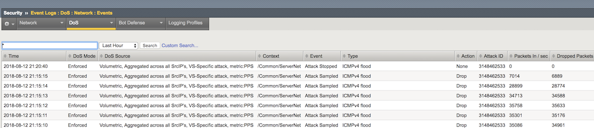
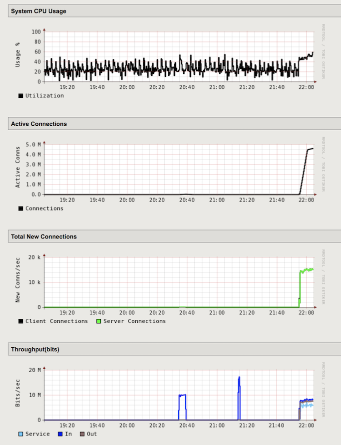
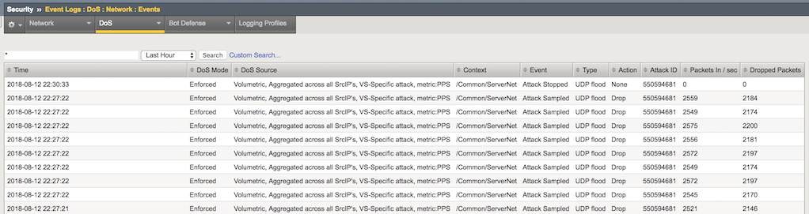
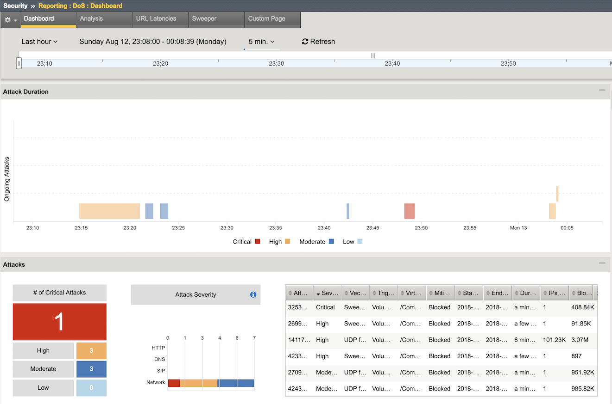

Lab - Configure Hybrid Defender Flood Protections
-------------------------------------------------

    This lab teachs you on how to configure DoS protection for common network-level DoS vectors.

Configure Protected Object-Level IPv4 Flood DHD DoS Protection
~~~~~~~~~~~~~~~~~~~~~~~~~~~~~~~~~~~~~~~~~~~~~~~~~~~~~~~~~~~~~~
    Configure object-level IPv4 ICMP flood protection, and then issue an ICMP DoS flood and review the results.

    #. On the **Protect Objects** page, in the Protected Objects section click **Create**.  

    #. Configure a protected object using the following information, and then click **Create**:

        ==========================   ======================
        Name:                        ServerNet           
        IP Address:                  10.1.20.0/24    
        Port:                        any           
        Protocol                     All Protocols       
        Protec. Settings Action:     Advertise All  
        Protec. Settings DDoS:       IPv4
        ==========================   ======================
        
    #. In the IPv4 row click the **+** icon, and then click **ICMPv4 flood** 

    #. On the right-side of the page configure using the following information, and then click Create.  

        ============================     =================
        Detection Threshold PPS:           Specify: 1000           
        Detection Threshold Percent:       Infinite 
        Rate/Leak Limit:                   Specify: 1000
        ============================     =================

        .. IMPORTANT::
            From now on, make sure you have an always-on terminal session with both the **attacker** and **LAMP** servers. Let them running the **bmon** utility, or a **tcpdump**. Those will provide instant and detailed visibility of the ammount of packets comming in/out of both virtual machines.
 
    #. From the **attacker** terminal session launch an ICMPv4 DoS attack using the Pentmenu tool (Options 2, 1) as follows:

        ============================     ===============
        target IP/hostname:              server1           
        source IP:                       r[random] 
        ============================     ===============

    #. Check out the **LAMP** terminal session and observe how many ICMP packets are hitting this server.  

    #. Before moving on, wait the attack to run for about 30 seconds or so 

    #. In the **Configuration Utility** go to Security-> DoS Protection-> DoS Overview. You should be able to see the DHD stopping the Attack.

        |image24|

    #. Now stop the Attack with **Ctrl + C**.

    #. Open the Security-> Event Logs-> DoS-> Network-> Events page.  

        The DoS Source is Volumetric, Aggregated across all SrcIP's, VS-Specific attack, metric:PPS.

        - The virtual server column displays /Common/ServerNet, identifying this is a protected object. 

        - The type is ICMPv4 flood.

        - The action is Drop.  

    #. Now check out the Security-> Event Logs-> DoS-> Network-> Events Page.

        |image25|

    #. The DHD was able to detect the moment the attack started and stopped, along with all volumetric info.

Configure Protected Object-Level UDP Flood Attack Protection
~~~~~~~~~~~~~~~~~~~~~~~~~~~~~~~~~~~~~~~~~~~~~~~~~~~~~~~~~~~~

    Configure object-level DoS UDP flood protection, and then issue an UPD flood and review the results.

    #. From the attacker terminal session launch an UDP flood attack using the Pentmenu tool (Options 2, 7) as follows:

        ==============================   ======================
        target IP/hostname:               server2           
        target port (defaults to 80):     default [ENTER] 
        random string (data to send):     F5Agility2018
        source IP:                        r[random] 
        ==============================   ======================

    #.  Let the attack run for about 30 seconds before moving on.
    #.  In the **Configuration Utility**, open the Statistics-> Performance-> Performance page.
        There is a spike in connections and throughput. The BIG-IP system is being hit with the UDP flood attack.

        |image26|

    #.  Open the DoS Protection-> Quick Configuration page and in the **Protected Objects** section click **ServerNet**.
    #.  In the **DDoS Settings** row click the **UDP** checkbox. In the UDP row click the **+** icon, and then click **UDP Flood**.
    #.  On the right-side of the page configure using the following information, and then click **Update**.

        ============================     =================
        Detection Threshold PPS:           Specify: 1000           
        Detection Threshold Percent:       Infinite 
        Rate/Leak Limit:                   Specify: 3000
        ============================     =================

    #. From the Attacker terminal session launch a new UDP flood attack using the same options and values as previously in this task.

    #. Let the attack run for about 30 seconds before moving on.

    #. In the **Configuration Utility**, click Security-> DoS Protection-> DoS Overview. You should be able to see the DHD stopping the DNS Attack.

        |image27|

    #. Now stop the Attack with **Ctrl + C**.

    #. Open the Security-> Event Logs-> DoS-> Network-> Events page.  

        - In one minute or so, the virtual server column displays **/Common/ServerNet**, identifying this is protected object.  

        - The type is UDP flood.  

        - The action is Drop.  

        |image28|  

Configure Bad Actor Detection
~~~~~~~~~~~~~~~~~~~~~~~~~~~~~

    Add bad actor detection for the UDP flood protection

    #.  In the **Configuration Utility**, open the DoS Protection-> Quick Configuration page and in the **Protected Objects** section click **ServerNet**.

    #. In the UDP row click the **+** icon, and then click **UDP Flood**.

    #. On the right-side of the page configure using the following information, and then click **Update**.

        ===============================   ======================
        Bad Actor Detection:               Yes (selected)           
        Per Source IP Detection (PPS):     Specify: 100 
        Per Source IP Rate Limit (PPS):    Specify: 30
        Blacklist Attacking Address:       Yes (selected) 
        Detection Time:                    30
        Duration:                          60
        ===============================   ======================

    #.  From the attacker virtual machine launch an UDP flood attack using a single IP address  [Pentmenu tool - Options 2, 7]:

        ==============================   ======================
        target IP/hostname:               server4           
        target port (defaults to 80):     53 
        random string (data to send):     F5Agility2018
        source IP:                        i[interface] 
        ==============================   ======================

    #. Let the attack run for like 30s seconds before moving on.

    #. Stop the attack with **Ctrl + C**.

    #. Now try to ping the **server4**. Try to ping the same address from the **goodclient** virtual machine. Does it work ???

    #. Stop the Attack with **Ctrl + C** and move to the next exercise.

Configure Protected Object-Based Sweep Protection
~~~~~~~~~~~~~~~~~~~~~~~~~~~~~~~~~~~~~~~~~~~~~~~~~

    #. In the **Configuration Utility**, open the DoS Protection-> Quick Configuration page and in the **Protected Objects** section click **ServerNet**.
    #. In the **DDoS Settings** row click the **Sweep** checkbox.
    #. In the **Sweep** row click the **+** icon, and then click **Sweep**.
    #. On the right-side of the page configure using the following information, and then click **Update**.

        ============================     ======================================
        Detection Threshold PPS:           Specify: 1000           
        Rate/Leak Limit:                   Specify: 3000
        Packet Types:                      Move All IPv4 to the Selected field    
        ============================     ======================================

    #. On the attacker machine type (or copy and paste) the following command:  
  
        ``sudo ./sweep.sh``  

    #. Let the attack run for like 30s seconds before moving on.  

    #. Stop the attack with **Ctrl + C**.

    #. In the **Configuration Utility**, click Security-> DoS Protection-> DoS Overview. You should be able to see the DHD stopping the Sweep attack.

        |image29|

Check out the DoS Visibility Page 
~~~~~~~~~~~~~~~~~~~~~~~~~~~~~~~~~

    #. Use the **DoS Visibility** page to view statistics about the DoS attacks you submitted during this exercise.

        |image30|

    #. Mouse over several of the attacks to get additional details of each attack.
    #. Scroll down in the left-side of the page to view the **Attacks** section.
    #. You can see the number of high, moderate, and low attacks in addition to the types of attacks (HTTP, ICMP, etc.) and the severity levels.

Check out the Silverline Portal 
~~~~~~~~~~~~~~~~~~~~~~~~~~~~~~~~~
    
    Use the Silverline portal to view details about the attacks launched in this exercise.

    #. Access the Silverline Portal https://portal.f5silverline.com  

    #. Open the Audit-> API Activity log page.

    #. Enter the hostname of your DHD device in the **Search field** and then check out the activity your Hybrid Defender device has reported back to the Silverline Scrubing Center.  

        |image41|

.. |image24| image:: ../media/image024.png

.. |image27| image:: ../media/image027.png

.. |image29| image:: ../media/image029.png

.. |image41| image:: ../media/image041.png
