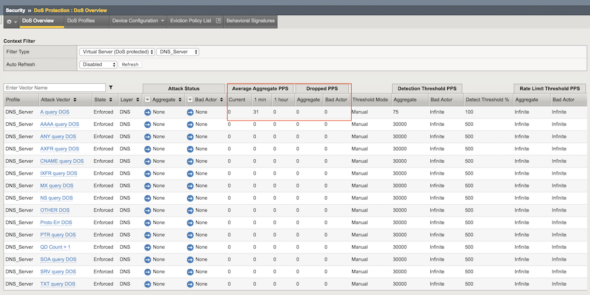
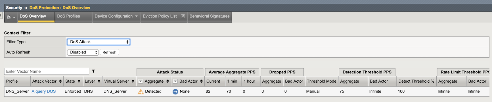
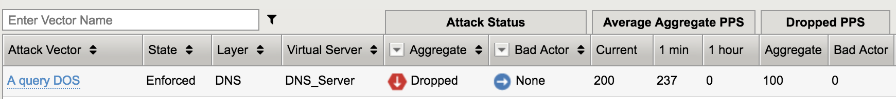

Lab - Preventing DNS DoS Attacks
--------------------------------

    Use a protected object to mitigate DNS query floods.

Use a Protected Object to Mitigate a DNS Query Flood
~~~~~~~~~~~~~~~~~~~~~~~~~~~~~~~~~~~~~~~~~~~~~~~~~~~~~~

    #.  In the **Protected Objects** section click Create.

    #. Configure a protected object using the following information, and then click Create.

        ==========================   ======================
        Name:                        DNS_Server           
        IP Address:                  10.1.20.14/32   
        Port:                        53           
        Protocol                     UDP       
        Protec. Settings Action:     Log and Mitigate 
        Protec. Settings DDoS:       DNS
        ==========================   ======================

    #. In the DNS row click the **+** icon, and then click **DNS A Query**.

    #. On the right-side of the page configure using the following information, and then click **Create**.

        ==========================   ======================
        Detection Threshold PPS:     Specify: 75 
        Rate Limit                   Specify: 100
        ==========================   ======================

Establish a DNS Baseline
~~~~~~~~~~~~~~~~~~~~~~~~

    Use a script to establish a DNS baseline on the BIG-IP DHD. 

    #. From the **goodclient** terminal session run the following commands:

        ``sudo ~/tools_agility_183/dnsbaseline.sh``  

    #. Let the baseline run until you get the following results:

        .. code::

            [Status] Testing complete (time limit)

            Statistics:

            Queries sent:         6000
            Queries completed:    6000 (100.00%)
            Queries lost:         0 (0.00%)

            Response codes:       NXDOMAIN 6000 (100.00%)
            Average packet size:  request 41, response 116
            Run time (s):         120.000552
            Queries per second:   49.999770

            Average Latency (s):  0.005793 (min 0.003970, max 0.020681)
            Latency StdDev (s):   0.001383

    #. In the **Configuration Utility**, go to Security-> DoS Protection-> DoS Overview.
    
    #. In the Filter Type select **Virtual Server** with **DNS_Server** protected object, then examine the a statistics for **DNS A Query**.

        |image31|

Initiate a DNS Attack
~~~~~~~~~~~~~~~~~~~~~
    Run a script to generate a DNS DoS alert. This script will send 80 pps of “A” queries just above our detection
    threshold PPS setting of 75. This is just the threshold that we are alerting at. It has not reached a high enough
    threshold to determine that we should do something about it. 

    #. From the attacker terminal session run the following commands:

        ``sudo ~/tools_agility_183/dnsdosattack.sh``  

    #. Wait for the attack to run for about 30 seconds before moving on.

    #. In the **Configuration Utility**, open the Security-> DoS Protection-> DoS Overview page.

    #. In the Filter Type select **DoS Attack**.

        |image32|
    
        .. NOTE:: 
            The A query DOS attack vector will be detected, but not yet blocked. It will take up to a couple minutes to display as Detected. 

    #. Wait for the attack to complete (if not done yet). Verify the results of the DNS attack from the **attacker** terminal session:

        .. code::

            [Status] Testing complete (time limit)

            Statistics:

            Queries sent:         28800
            Queries completed:    27217 (94.50%)
            Queries lost:         1583 (5.50%)

            Response codes:       NXDOMAIN 27217 (100.00%)
            Average packet size:  request 41, response 116
            Run time (s):         360.000538
            Queries per second:   75.602665

            Average Latency (s):  0.004487 (min 0.002909, max 0.036921)
            Latency StdDev (s):   0.001372

Initiate a DNS Attack that Exceeds the Rate Limit
~~~~~~~~~~~~~~~~~~~~~~~~~~~~~~~~~~~~~~~~~~~~~~~~~

    Run another script that initiates a DNS DoS attack that exceeds the rate limit we set earlier.

    #. From the attacker terminal session run the following commands:

        ``sudo ~/tools_agility_183/dnsdosrate.sh``  
    
    #. Wait for the attack to run for about 30 seconds before moving on.

    #. In the **Configuration Utility** Review the DoS Overview page -> Security-> DoS Protection-> DoS Overview.

        |image33|

        .. NOTE:: 
            The A query DOS attack vector is now dropping attack traffic.

        Also take a look at the script which will record the number of drops if any as a result of the attack rate limit being hit. You should be able to correlate the drops registered with the script with the drops recorded by the Hybrid Defender.

        .. code::

            Statistics:

            Queries sent:         5899
            Queries completed:    3504 (59.40%)
            Queries lost:         2395 (40.60%)

            Response codes:       NXDOMAIN 3504 (100.00%)
            Average packet size:  request 41, response 116
            Run time (s):         120.000642
            Queries per second:   29.199844

            Average Latency (s):  0.006696 (min 0.002080, max 0.087619)
            Latency StdDev (s):   0.003606

    #. In the **Configuration Utility** open the Statistics-> DoS Visibility page.

    #. View the attack details in the **Attacks** section.

    

