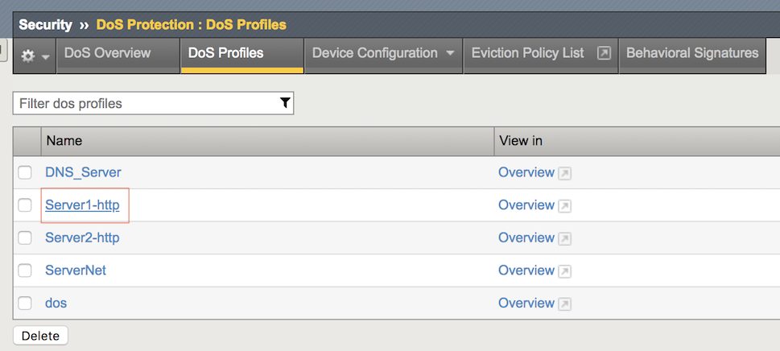
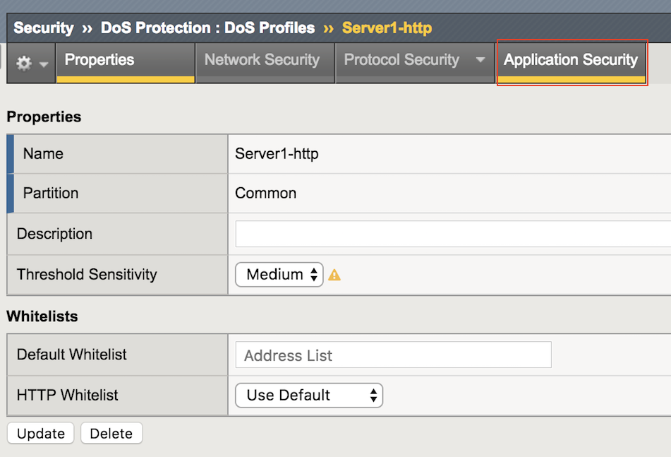
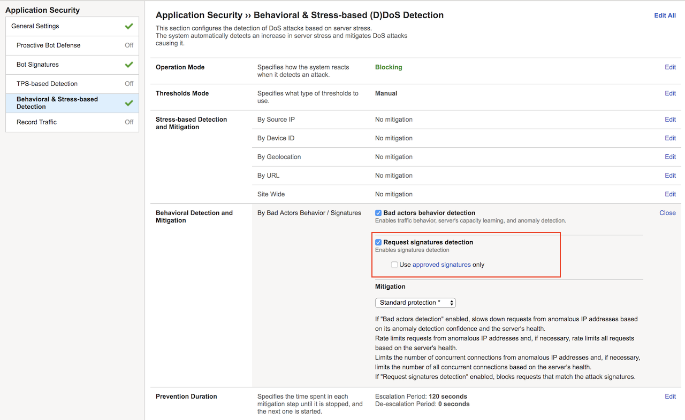
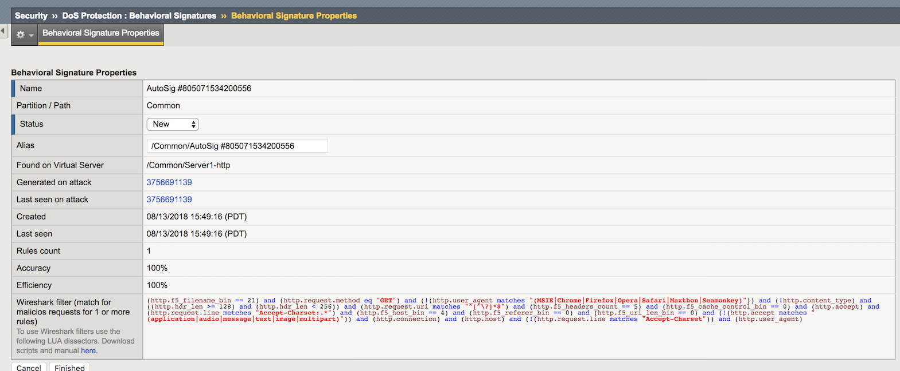

Lab – Configure Application Layer DoS Defenses
----------------------------------------------

    Check out how to detect and mitigate application layer attacks, not matter if it's encrypted or behavioral based.

Create Protected Object for Behavioral DoS Protection
~~~~~~~~~~~~~~~~~~~~~~~~~~~~~~~~~~~~~~~~~~~~~~~~~~~~~~~~~~~~~~~~~~~~~~~~~

    #. In the **BIG-IP Configuration Utility**, open the DoS Protection-> Quick Configuration page and in the **Protected Objects** section click **Create**.

    #. Configure the protected object **Server1-http** using the following information:

        =============================   ======================
        Name:                           Server1-http           
        IP Address:                     10.1.20.11/32   
        Port:                           80
        VLAN:                           defaultVLAN
        Protec. Settings Action:        Log and Mitigate 
        Protec. Settings Silverline:    Yes (selected) 
        Protec. Settings DDoS:          IPv4, TCP, HTTP
        =============================   ======================

    #. In the HTTP row click the **+** icon, and then click **Behavioral**, then from the **Mitigation** list select **Standard Protection**.

    #. In the HTTP section click **Proactive Bot Defense**, then from the **Mitigate Action** list select **Disabled**, finally click **Create**

        .. NOTE:: 
            Both the good and bad (attack) traffic are generated with tools that would be blocked by **Proactive Bot Defense**. Please note that by default, the Hybrid Defender will set Proactive Bot Defense to **always**'.
            That's the reason why we're disabling it, only to allow the scripts to work and generate sample traffic.

    #. In the **Protected Objects** section click **Create**.

    #. Open the Security-> DoS Protection-> DoS Profiles page and click **Server1-http**.

        |image34|

    #. Open the **Application Security** page.

        |image35|
    
    #. Click **Behavioral & Stress-based Detection**, and then for **Behavioral Detection and Mitigation** click **Edit**.
    
    #. Select the **Request signatures detection** checkbox, and then click **Update**.

        |image36|

Generate L7 Behavioral baseline for Server1-http
~~~~~~~~~~~~~~~~~~~~~~~~~~~~~~~~~~~~~~~~~~~~~~~~

    Use a script to generate an L7 behavioral DoS baseline for the Hybrid Defender.

    #. In the **goodclient** terminal session, type (or copy and paste) the following command:

        ``sudo ~/tools_agility_183/generate_clean_traffic.sh``      

    .. NOTE:: 
        This will generate traffic. Please note that it will take at least 15 minutes.

    .. code::

        f5student@goodclient:~/tools_agility_183$ ./generate_clean_traffic.sh
        welcome.php	status: 200	bytes: 1045	time: 0.017
        welcome.php	status: 200	bytes: 1045	time: 0.014
        welcome.php	status: 200	bytes: 1045	time: 0.014
        welcome.php	status: 200	bytes: 1045	time: 0.015
        headers.php	status: 200	bytes: 1847	time: 0.014
        headers.php	status: 200	bytes: 1847	time: 0.014
        httprequest.php	status: 200	bytes: 710	time: 0.013
        httprequest.php	status: 200	bytes: 710	time: 0.014
        httprequest.php	status: 200	bytes: 710	time: 0.014
        httprequest.php	status: 200	bytes: 710	time: 0.013
        badlinks.html	status: 200	bytes: 1270	time: 0.014
        badlinks.html	status: 200	bytes: 1270	time: 0.014
        F5_building.jpg	status: 200	bytes: 33447	time: 0.019
        F5_building.jpg	status: 200	bytes: 33447	time: 0.021
        bigip4200.jpg	status: 200	bytes: 9753	time: 0.016
        bigip4200.jpg	status: 200	bytes: 9753	time: 0.017
        viprion2400.jpg	status: 200	bytes: 13009	time: 0.016
        viprion4800.jpg	status: 200	bytes: 10078	time: 0.018
        viprion4800.jpg	status: 200	bytes: 10078	time: 0.017

    #. Move on in the exercises while the baseline is being generated.

    #. Open a terminal session with the DHD and run the following command:

        ``admd -s vs./Common/Server1-http.info -s vs./Common/Server1-http.sig.health`` 

    .. code::

        [root@dhd-01:Active:Standalone]# admd -s vs./Common/Server1-http.info -s vs./Common/Server1-http.sig.health
        vs./Common/Server2-http.sig.health:[0.452373]
        vs./Common/Server2-http.sig.health:[0.453407]
        vs./Common/Server2-http.sig.health:[0.451726]
        vs./Common/Server2-http.sig.health:[0.45372]
        vs./Common/Server2-http.sig.health:[0.452021]
        vs./Common/Server2-http.sig.health:[0.45349]

    .. IMPORTANT::
            The results for each health check should **not** be 0.5, otherwise the system ins't learning. Let both terminal sessions opened for the rest of this lab. 

Configure DoS Protection for L7 Encrypted Traffic
~~~~~~~~~~~~~~~~~~~~~~~~~~~~~~~~~~~~~~~~~~~~~~~~~~

    Launch an encrypted Slowloris attack to the web server and view the results, then configure proper mitigation on the Hybrid Defender.

    #.  Go to  DoS Protection-> Quick Configuration page and in the **Protected Objects** section click **Create**.

    #. Configure another **Protected Object** using the following information, and then click **Create**.

        =============================   ======================
        Name:                           Server2-http          
        IP Address:                     10.1.20.12/32   
        Port:                           80
        VLAN:                           defaultVLAN            
        Protec. Settings Action:        Log and Mitigate 
        Protec. Settings Silverline:    Yes (selected) 
        Protec. Settings DDoS:          IPv4, TCP, HTTP
        =============================   ======================

    #. Now repeat the steps for disabling the Proactive Bot Defense which allows the HTTP request scripts to work.
    
    #. Go to the **HTTP** section and click **Proactive Bot Defense**, then from the **Mitigate Action** list select **Disabled**.

    #. In the HTTP section click **DoS Tool**, then from the **Mitigate Action** list select **Report**, and then click **Create**.

    #. Now run the monitor script on **server2** as follows. It will be usefull for server health monitoring.

         ``~/tools_agility_183/server2_monitor.sh``    

    #. Before launching the application layer attack, observe **server2** is currently healthy.

        .. code::

            welcome.php     status: 200	bytes: 1045     time: 0.018
            bigtext.html    status: 200	bytes: 634965   time: 0.136
            httprequest.php status: 200	bytes: 710      time: 0.017

        .. NOTE:: 
            The system is healthy since the web server returns **HTTP Status Code 200** for every request.

    #. Now from the **attacker** terminal session run the following command:

        ``~/tools_agility_183/slowloris.sh`` 

        .. code::

            Mon Aug 13 11:26:54 2018:
            slowhttptest version 1.6
            - https://code.google.com/p/slowhttptest/ -
            test type:                        SLOW HEADERS
            number of connections:            4090
            URL:                              https://server2.f5demo.com/
            verb:                             GET
            Content-Length header value:      4096
            follow up data max size:          68
            interval between follow up data:  10 seconds
            connections per seconds:          200
            probe connection timeout:         5 seconds
            test duration:                    240 seconds
            using proxy:                      no proxy

            Mon Aug 13 11:26:54 2018:
            slow HTTP test status on 30th second:
            initializing:        0
            pending:             1790
            connected:           150
            error:               0
            closed:              2092
            service available:   **NO**

    #. Observe how the service is impacted as the slowloris attack hits the **server2.f5demo.com**.

        .. code::

            welcome.php     status: 000	bytes: 0    time: 1.002
            bigtext.html    status: 000	bytes: 0    time: 1.002
            httprequest.php status: 000	bytes: 0    time: 1.002

        .. NOTE:: 
            Since the slowloris attack is being encrypted (https://server2.f5demo.com) we need to setup the certificate and private keys so the traffic can be inspected by the Hybrid Defender..

    #. Configure SSL on the protected object to in order to inspect HTTPS traffic.
    
    #. Go to DDoS Protection-> Quick Configuration-> Protected Objects, then click **Server2-http**. Configure the SSL as follows:

        =============================    ===============
        Port:                            443
        SSL:                             Enabled
        SSL Certificate:                 default
        Key:                             default
        Encrypt Connection to Server:    Yes (selected)   
        =============================    ===============
    
    #. Disable bot protections so the scripts can be used for testing the server health.

    #. On the **Server2-http** Protected Object section go to the **HTTP** row, click the **+** icon, click **Behavioral**
    
    #. Now from the **Mitigation** list select **Standard Protection**.

    #. In the HTTPS section click **Proactive Bot Defense**, then from the **Mitigate Action** list select **Disabled**.

    #. Now that SSL is also being inspected for this Protected Object, let's run the slowloris script once again and verify if the attack still works.

– Behavioral L7 DoS Mitigation
~~~~~~~~~~~~~~~~~~~~~~~~~~~~~~

    Once the L7 behavioral baseline has been established, launch an L7 DoS attack and view the results.

    #. Now get back to the DHD terminal session. 
    
    #. You will need to observe the info.learning signature to ensure that the system has accumulated enough learning details.

    #. This signature has 4 comma-separated values for monitoring the learning progress:

        - Value #1: baseline-learning_confidence
            This should be between 80 - 90%
        - Value #2: learned_bins_count (the number of learned bins)
            This should be > 0
        - Value #3: good_table_size (the number of learned requests)
            This should be > 4000
        - Value #4: good_table_confidence (how confident, as a percentage, the system is) 
            It must be 100% for behavioral signatures

            .. code::

                vs./Common/Server1-http.info.learning:[96.3163, 78, 5355, 100]

    #. If you see the pattern such as that described, it indicates the traffic baseline was already established, then you can move forward with the lab.

    #. Once the info.learning values are acceptable based on the details above, from the **attacker** terminal session run the following command:

        ``~/tools_agility_183/http_flood.sh``  

    #. Select option "1"

    #. Now take a look at the **goodclient** terminal session, you should start seeing the effects of the HTTP DoS attack, as requests are starting to fail **(HTTP Status Code 000)**. If you were to examine the **Lamp** server at this time, you would see that it is under severe stress.

        .. code::

            welcome.php	status: 200	bytes: 1045	time: 0.017
            welcome.php	status: 200	bytes: 1045	time: 0.029
            welcome.php	status: 000	bytes: 0	time: 1.000
            headers.php	status: 000	bytes: 0	time: 1.001
            headers.php	status: 200	bytes: 1847	time: 0.204
            headers.php	status: 200	bytes: 1847	time: 0.258
            headers.php	status: 200	bytes: 1847	time: 0.218
            badlinks.html	status: 000	bytes: 0	time: 1.001
            badlinks.html	status: 200	bytes: 1270	time: 0.242
            badlinks.html	status: 200	bytes: 1270	time: 0.272
            badlinks.html	status: 000	bytes: 0	time: 1.002
            bigip4200.jpg	status: 200	bytes: 9318	time: 0.247

    #. Also from the DHD terminal session watch the health signal feed. You should see it climb from ~.5, which is optimal health, to values over 1, indicating an increase in server stress. You will also be able to watch as the system responds and mitigations are engaged.

    #. When the system has analyzed the attack traffic, dynamic signatures are created and engaged:

        .. code::

            vs./Common/Server1-http.sig.health:[0.768427]
            vs./Common/Server1-http.info.attack:[1, 1]
            vs./Common/Server1-http.sig.health:[0.746648]
            vs./Common/Server1-http.info.signature:["Stable signature detected: (http.f5_filename_bin == 21) and (http.request.method eq \"GET\") and (!(http.user_agent matches \"(MSIE|Chrome|Firefox|Opera|Safari|Maxthon|Seamonkey)\")) and (!http.content_type) and ((http.hdr_len->= 128) and (http.hdr_len < 256)) and (http.request.uri matches \"^[^\\\\?]*$\") and (http.f5_headers_count == 5) and (http.f5_cache_control_bin == 0) and (http.accept) and (http.request.line matches \"Accept-Charset:.*\") and (http.f5_host_bin == 4) and (http.f5_referer_bin == 0) and (http.f5_uri_len_bin == 0) and (!(http.accept matches \"(application|audio|message|text|image|multipart)\")) and (http.connection) and (http.host) and (!(http.request.line matches \"Accept-Charset\")) and (http.user_agent)"]
            vs./Common/Server1-http.info.attack:[1, 1]
            vs./Common/Server1-http.sig.health:[0.726608]
            vs./Common/Server1-http.info.attack:[1, 1]
            vs./Common/Server1-http.sig.health:[0.709827]
            vs./Common/Server1-http.info.attack:[1, 1]
            vs./Common/Server1-http.sig.health:[0.691779]

    #. In the **Configuration Utility**, notice the indicator at the top-left side of the page.

        |image37|

    #. As you watch the feed, you should see HTTP requests being served again after the dynamic signature kicks in.

    #. In the **Configuration Utility** open the Security-> DoS Protection-> Behavioral Signatures page.

        |image39|

        You will see a signature that was created (as seen in the output of the ``admd``  command earlier). Note
        the system reports metrics such as Accuracy (an estimate of the percentage of traffic that will be
        blocked that is definitely hostile) and Efficiency (a measure of how much of the observed DoS traffic is
        mitigated by that signature). In our lab these values are both at or near 100%. In a real environment
        the Accuracy should be very high, but sometimes Efficiency will be lower (in a mutating attack) and
        the system may have to create additional signatures or refine the current one based on effectiveness.      

    #. Click the new signature. 

        Note the Wireshark filter at the bottom which can be used in conjunction with the Record Traffic
        feature of F5's L7 DoS to identify exactly which requests the signature matches/will match. This can
        be helpful if using the "Approved Only" in the DoS profile setting to allow a risk-averse administrator
        to approve signatures before they begin to filter traffic.

    #. Change the Alias value to **Agility2018**, and then click Finished.

– View Silverline Signals
~~~~~~~~~~~~~~~~~~~~~~~~~~

    Use the Silverline portal to view details about the L7 DoS attacks that were launched in this exercise.

    #. Click **Alerts for Hybrid Defender**.

    #. Open the Audit-> API Activity Log page.

        |image41|

    #. Click the **+** icon to expand one of the entries to view additional attack details.

        That completes the hands-on exercise for BIG-IP DDoS Hybrid Defender.

.. |image37| image:: ../media/image037.png

.. |image41| image:: ../media/image041.png
