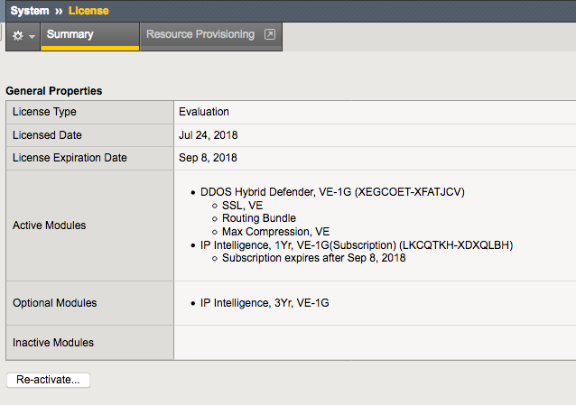
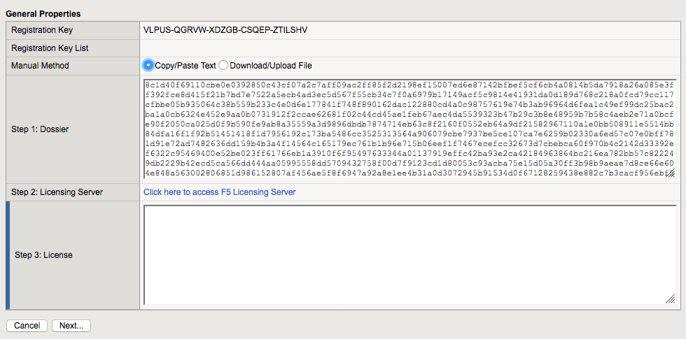
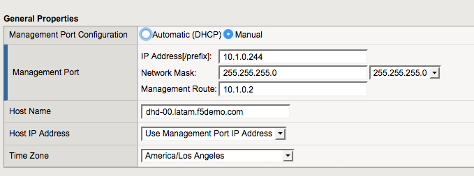
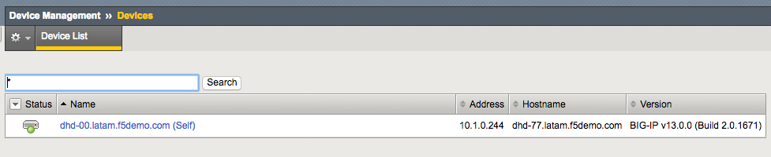
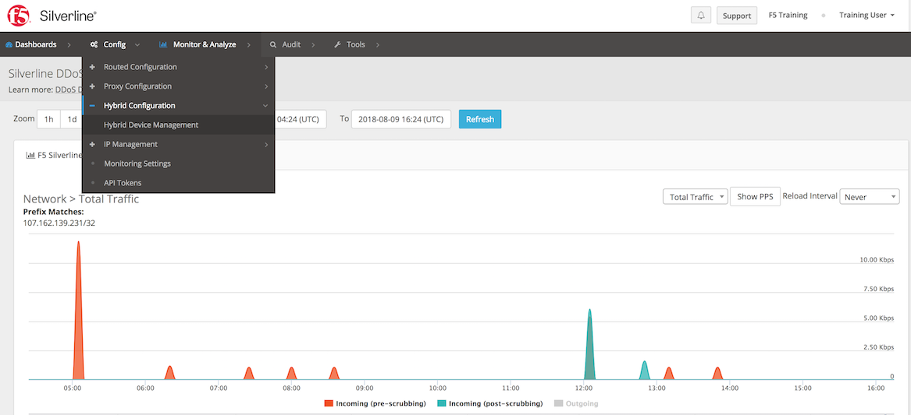
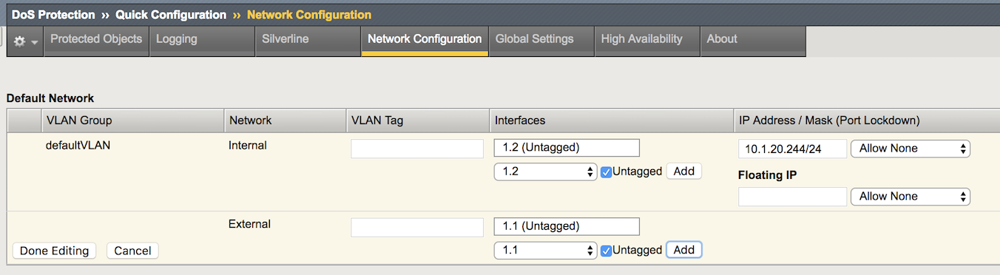
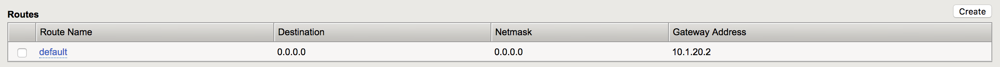

Hybrid Defender Setup
---------------------

Getting Started
================

Lab Diagram
~~~~~~~~~~~

        |image2|

  .. NOTE::
    You may have noticed that although clients (goodclient, attacker) and server (LAMP) are siting at the same network subnet [10.1.20.0/24], they're in different VLANs actually (internal - ID 20 vs external - ID 10). Those two VLANs will be grouped toghether (VLAN Group) and act like a single Layer-2 broadcast domain.

Networking Info
~~~~~~~~~~~~~~~

  IP addressing, Out of Band management, and credentials for all components:

  .. list-table::
      :widths: 20 40 40
      :header-rows: 1

      * - **Component**
        - **VLAN/IP Address(es)**
        - **Credentials**
      * - jumphost
        - - **Management:** 10.1.0.51
          - **internal:** 10.1.20.51
        - ``f5student``/``[will be provided]``

      * - attacker
        - - **Management:** 10.1.0.52
          - **internal:** 10.1.20.52
        - ``f5student``/``[will be provided]``

      * - goodclient
        - - **Management:** 10.1.0.53
          - **internal:** 10.1.20.53
        - ``f5student``/``[will be provided]``

      * - lamp
        - - **Management:** 10.1.0.252
          - **internal:** 10.1.20.252
        - ``f5``/``[will be provided]``

      * - F5-DHD
        - - **Management:** 10.1.0.244
          - **internal:** 10.1.20.244
        - ``root``/``[will be provided]``

Accessing the lab environment
~~~~~~~~~~~~~~~~~~~~~~~~~~~~~

  #. Open a browser and go to http://training.f5agility.com, then enter your Class# and Student# as provided by your instructor.
    
      |image1|    

  #. Look for the **jumphost** virtual machine. Use the RDP client of your choice and work from there, you are going to use it for all labs.

    .. HINT::

        You can use either use the PUTTY client provisioned on your jumphost desktop, or native shell prompt in order to access both **goodclient** and **attacker** virtual machines. 
        Private keys have been configured in advance so you won't need passwords.
        A few scripts require root access. Don't forget to **sudo** before running attacks, baselines, etc.  

  #.  Run the following scripts from both **goodclient** and **attacker** hosts. It's going to sync the tools to be used in the entire lab.  

      ``~/update_tools.sh``

Re-License your DHD Device
==========================

  .. IMPORTANT::
    For Silverline device registration to function properly the Hybrid Defender device must have a unique device ID, which is comprised of unique attributes like Base MAC and registration key.

  For the following steps please use the registration key provided by your instructor.

  #. Go to System->License and then click on **Re-activate**.  

      |image3|

  #. Edit the **Base Registration Key**, replacing it by the new license key. The **Activation Method** option must be manual. Then click **Next**.  

      |image4|

  #. Select all in the **Dossier** frame and copy it.  Click on **Click here to access F5 Licensing Server**.  

     |image5|

  #. Agreee with the contract terms, copy the contents in the license frame, then click **Next** ”.  

     |image6|

  #. Go back to your F5 DHD and paste the contents copied from the above. **License** and click **Next**.  

     |image7|

    .. Hint::
      The BIG-IP will restart daemons and a window will pop up indicating system configuration has changed.  Please wait for it to reconnect and click **Continue**. Your device is now licensed.  Click **Next**

Perform Initial DHD Network Configuration
=========================================

    #. In the **BIG-IP Configuration Utility**, open the DoS Protection-> Quick Configuration page.

    #. Open the Network Configuration page, then In the **Default Network** section click **defaultVLAN**.

    #. Configure the Default Network settings as follows, the click on **Done Editing**

      ==========================   ======================================  
      Internal VLAN tag:              blank                                
      Internal Interfaces:            1.2 (Click untagged/Add)                    
      External VLAN tag:              blank       
      External Interfaces:            1.1 (Click untagged/Add)         
      IP Address/Mask:                10.1.20.244/24                       
      ==========================   ====================================== 

      |image21|

    #. In the Routes section click **Create**.

    #. Configure the route using following information, and then click **Done Editing**, and then click **Update**.

      ==========================   ===========  
      Route name:                   default                                
      Destination:                  0.0.0.0                   
      Netmask:                      0.0.0.0
      Gateway Address:              10.1.20.2    
      ==========================   ===========

      |image22|

    #. By this time you should be able to reach the **LAMP** server from both **attacker** and **gooclient** machines. Open up a terminal shell with both machines and confirm the can reach out to the **LAMP** server before moving forward.
        
      .. code::

        f5student@attacker:~$  ping -c 3 server1
        PING server1.f5demo.com (10.1.20.11) 56(84) bytes of data.
        64 bytes from server1.f5demo.com (10.1.20.11): icmp_seq=1 ttl=64 time=9.73 ms
        64 bytes from server1.f5demo.com (10.1.20.11): icmp_seq=2 ttl=64 time=6.21 ms
        64 bytes from server1.f5demo.com (10.1.20.11): icmp_seq=3 ttl=64 time=5.88 ms

        --- server1.f5demo.com ping statistics ---
        3 packets transmitted, 3 received, 0% packet loss, time 2002ms
        rtt min/avg/max/mdev = 5.880/7.277/9.736/1.744 ms
        f5student@attacker:~$

Register DHD Device with Silverline
====================================

  For Silverline signaling we will be leveraging both the DHD built-in signaling, as well as bandwidth utilization reporting for Hybrid DDoS protection.  

    #. Go to System-> Platform menu and change the hostname as below. This will make easier to identify alerts from your particular device in the Silverline Portal. When finished, click **Update**.
      
        ``dhd-[student#].latam.f5demo.com``  
        
        |image8|

    #. In Device Management->Devices select the device and then click **Change Device Name**.  

        |image9|

    #. Update the device name to match the hostname you have chosen. **Important**: Use your student number.

        |image11|

    #. Open a terminal sesson with the Hybrid Defender and restart services:
  
        ``bigstart restart``

    #. Now proceed with the Silverline registration. Go to DoS Protection-> Quick Configuration-> Silverline. Fill out the **Authentication Credentials** fields  as follows, then click **Update**.

      ===========   =============================
      username      dhd2018us@f5agility.com        
      password      **[will be provided]**               
      Service URL   https://api.f5silverline.com  
      ===========   =============================  

      |image12|

      .. Hint::
          That screen provides no feedback when the authentication actually works, so no worries. Go to the next step unless you got an error message here.

      - From another tab in your browser, access the Silverline Portal https://portal.f5silverline.com  using same DHD admin account. 

      - Navigate to Config-> Hybrid Config-> Hybrid Device Management

        |image13| 

      - Enter the hostname of your DHD device in the Search field. Verify that you have both registrations. Approve them and you're done!  

        |image14|

.. |image1| image:: media/dashboard_student.png
.. |image2| image:: media/lab_network_topology.png

.. |image4| image:: media/image004.png

.. |image6| image:: media/image006.png
.. |image7| image:: media/image007.png

.. |image10| image:: media/image010.png
.. |image11| image:: media/image011.png
.. |image12| image:: media/image012.png

.. |image14| image:: media/image014.png

